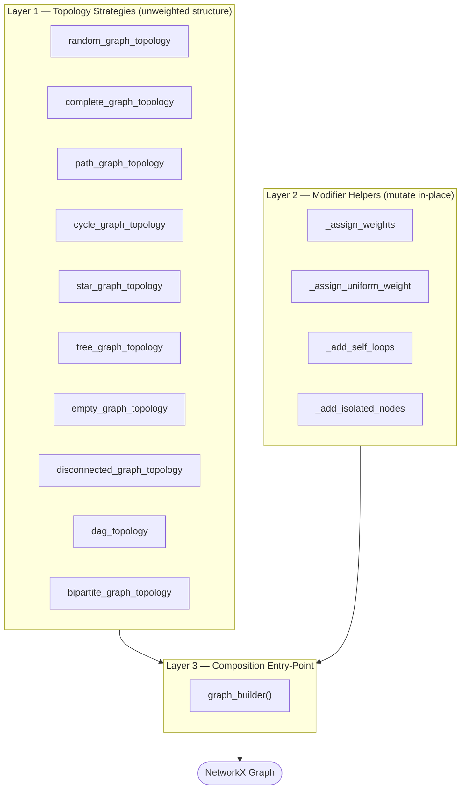
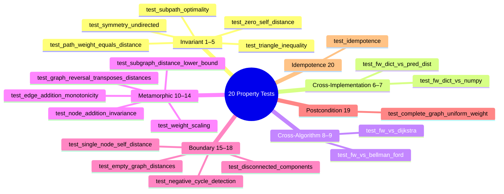
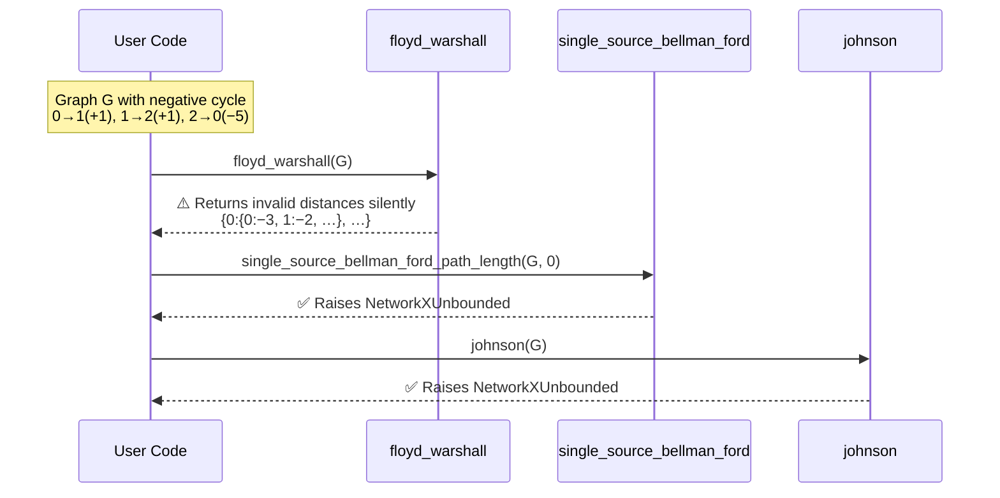

# Property-Based Testing: Floyd-Warshall All-Pairs Shortest Paths

**Course:** E0 251o Data Structures & Graph Analytics (2026)
**Team member:** Brijgopal Bharadwaj (`brijgopalb@iisc.ac.in`)

---

## Algorithm Under Test

The **Floyd-Warshall** family from
[`networkx.algorithms.shortest_paths.dense`](https://github.com/networkx/networkx/blob/main/networkx/algorithms/shortest_paths/dense.py)
computes all-pairs shortest-path distances in O(V^3) time.

| Function | Returns | Purpose |
|---|---|---|
| `nx.floyd_warshall(G)` | `dict[dict]` of distances | Convenience wrapper |
| `nx.floyd_warshall_predecessor_and_distance(G)` | `(predecessors, distances)` dicts | Full output with path reconstruction data |
| `nx.floyd_warshall_numpy(G, nodelist)` | `numpy.ndarray` distance matrix | NumPy-based implementation |
| `nx.reconstruct_path(source, target, pred)` | shortest-path node list | Extracts path from predecessor dict |

### Why Floyd-Warshall?

Floyd-Warshall has rich mathematical structure that lends itself to
property-based testing: triangle inequality, subpath optimality (Bellman's
principle), symmetry in undirected graphs, transpose relationships under
edge reversal, and linear scaling under weight multiplication.  It also
has three distinct implementations in NetworkX (dict, dict+predecessors,
numpy) whose outputs can be cross-validated against each other, plus two
independent algorithms (Dijkstra, Bellman-Ford) that serve as external
oracles for differential testing.

---

## Project Structure

```
brijgopalb@iisc.ac.in/
├── test_floyd_warshall.py   # Single self-contained file: strategies + 20 property tests + bug discovery
├── requirements.txt         # Python dependencies
├── .gitignore               # Excludes __pycache__, .hypothesis/, .pytest_cache/
└── README.md                # This file
```

The project follows the rubric requirement of a **single Python file**
containing all imports, graph-generation strategies, helper functions,
and property-based tests with detailed docstrings.

---

## Running the Tests

```bash
pip install -r requirements.txt
pytest test_floyd_warshall.py -v
```

To view Hypothesis statistics (showing `event()` and `target()` output):

```bash
pytest test_floyd_warshall.py -v --hypothesis-show-statistics
```

Tested against **NetworkX 3.6.1**, **Hypothesis >= 6.0**, **NumPy >= 1.24**,
**Python 3.12**.

---

## Graph Generation Library

### Design Decision: Functions over Classes

Hypothesis strategies are first-class objects that compose natively via
`draw()`, `st.one_of()`, and `st.flatmap()`.  Wrapping them in a class
would add indirection without improving composability.  The Hypothesis
documentation, `hypothesis-networkx`, and NetworkX's own test suite all
use the functional `@st.composite` pattern.

### Architecture: Three Composable Layers



**Layer 1 -- Topology strategies** produce unweighted graph structure.
Every topology strategy has a uniform signature
`(draw, min_nodes, max_nodes, directed)` so any can be plugged into
`graph_builder`.

| Strategy | Structure |
|---|---|
| `random_graph_topology` | Erdos-Renyi G(n,p) |
| `complete_graph_topology` | Complete graph / digraph |
| `path_graph_topology` | Linear path 0 -> 1 -> ... -> n-1 |
| `cycle_graph_topology` | Single cycle on n nodes |
| `star_graph_topology` | Hub connected to n-1 leaves |
| `tree_graph_topology` | Random labeled tree (Prufer-based) |
| `empty_graph_topology` | n nodes, zero edges |
| `disconnected_graph_topology` | Two disjoint cliques |
| `dag_topology` | Random DAG (edges go low-index to high-index) |
| `bipartite_graph_topology` | Two-partition random bipartite graph |

**Layer 2 -- Modifier helpers** mutate a graph in-place:

| Helper | Effect |
|---|---|
| `_assign_weights` | Independent random integer weight per edge |
| `_assign_uniform_weight` | Same random weight for every edge |
| `_add_self_loops` | Positive-weight self-loops on random node subset |
| `_add_isolated_nodes` | Append 1-3 degree-0 nodes |

**Layer 3 -- `graph_builder()`** is the single composable entry-point:

```python
from test_floyd_warshall import graph_builder, cycle_graph_topology

# Mixed topologies, positive weights (default)
@given(G=graph_builder())

# Specific topology
@given(G=graph_builder(topology=cycle_graph_topology))

# Undirected, non-negative weights
@given(G=graph_builder(directed=False, min_weight=0))

# With structural edge-cases
@given(G=graph_builder(self_loops=True, isolated_nodes=True, uniform_weight=True))
```

**Specialized strategies** that have bespoke construction logic and cannot
be expressed through the generic builder:

| Strategy | Why standalone |
|---|---|
| `dag_with_weights` | Requires DAG edge-ordering invariant (i < j) with negative weights |
| `negative_cycle_digraph` | Constructs a Hamiltonian cycle and forces its total weight negative |

### Edge-Case Coverage Audit

An empirical audit (100 samples per strategy) confirmed the following
coverage:

| Feature | Generated? | Why it matters |
|---|---|---|
| Self-loops | Yes (`self_loops=True`) | Positive self-loop must not change dist(v,v)=0 |
| Isolated nodes | Yes (`isolated_nodes=True`) | Must produce dist(iso, v) = inf for v != iso |
| Uniform weights | Yes (`uniform_weight=True`) | Tests BFS-equivalence degenerate case |
| Zero-weight edges | Yes (`min_weight=0`) | Boundary for non-negative weight assumptions |
| Negative edges (no negative cycle) | Yes (`dag_with_weights`) | DAG guarantees safety |
| Negative cycles | Yes (`negative_cycle_digraph`) | Must produce dist(v,v) < 0 on cycle nodes |
| Disconnected components | Yes (`disconnected_graph_topology`) | Cross-component dist must be inf |
| Empty graph | Yes (`empty_graph_topology`) | Degenerate boundary with 0 edges |
| Bipartite structure | Yes (`bipartite_graph_topology`) | Restricted connectivity patterns |

---

## Properties Tested (20 tests + 1 bug discovery)



### Invariant Properties (Tests 1-5)

| # | Test | Property | Generator |
|---|------|----------|-----------|
| 1 | `test_zero_self_distance` | dist(v, v) == 0 for all v (no negative cycles) | `graph_builder()` + `@example` with self-loop graph |
| 2 | `test_triangle_inequality` | dist(u, w) <= dist(u, v) + dist(v, w) | `dag_with_weights()` + `target()` |
| 3 | `test_symmetry_undirected` | dist(u, v) == dist(v, u) in undirected graphs | `graph_builder(directed=False)` |
| 4 | `test_path_weight_equals_distance` | reconstruct_path weight matches reported dist | `graph_builder(topology=random_graph_topology)` |
| 5 | `test_subpath_optimality` | Every sub-path of a shortest path is optimal (Bellman) | `graph_builder(topology=random_graph_topology)` |

### Cross-Implementation Consistency (Tests 6-7)

| # | Test | Property | Generator |
|---|------|----------|-----------|
| 6 | `test_fw_dict_vs_pred_dist` | `floyd_warshall` == `floyd_warshall_predecessor_and_distance` | `dag_with_weights()` |
| 7 | `test_fw_dict_vs_numpy` | `floyd_warshall` dict == `floyd_warshall_numpy` matrix | `graph_builder(topology=random_graph_topology)` |

### Cross-Algorithm Validation (Tests 8-9)

| # | Test | Property | Generator |
|---|------|----------|-----------|
| 8 | `test_fw_vs_dijkstra` | FW distances match Dijkstra (non-negative weights) | `graph_builder(topology=random_graph_topology)` + `event()` |
| 9 | `test_fw_vs_bellman_ford` | FW distances match Bellman-Ford (negative weights, no neg cycles) | `dag_with_weights()` |

### Metamorphic Properties (Tests 10-14)

| # | Test | Property | Generator |
|---|------|----------|-----------|
| 10 | `test_weight_scaling` | Scaling weights by k scales distances by k | `graph_builder(topology=random_graph_topology)` |
| 11 | `test_edge_addition_monotonicity` | Adding a non-negative edge can only decrease distances | `graph_builder(min_weight=0)` + `data.draw()` |
| 12 | `test_subgraph_distance_lower_bound` | dist_G(u,v) <= dist_H(u,v) for subgraph H of G | `graph_builder(topology=random_graph_topology)` + `data.draw()` |
| 13 | `test_graph_reversal_transposes_distances` | dist_G(u,v) == dist_{G^R}(v,u) | `dag_with_weights()` |
| 14 | `test_node_addition_invariance` | Adding an isolated node preserves all existing distances | `graph_builder(topology=random_graph_topology)` |

### Boundary / Edge-Case Properties (Tests 15-18)

| # | Test | Property | Generator |
|---|------|----------|-----------|
| 15 | `test_single_node_self_distance` | Single node: dist(v,v) = 0 | Parametric on `node_id` |
| 16 | `test_empty_graph_distances` | Zero edges: diagonal=0, off-diagonal=inf | `empty_graph_topology()` |
| 17 | `test_disconnected_components` | Cross-component distances are infinite | `graph_builder(topology=disconnected_graph_topology)` |
| 18 | `test_negative_cycle_detection` | Negative cycle produces dist(u,u) < 0 | `negative_cycle_digraph()` |

### Postcondition Properties (Test 19)

| # | Test | Property | Generator |
|---|------|----------|-----------|
| 19 | `test_complete_graph_uniform_weight` | Complete digraph with uniform weight w: dist(u,v) = w | Parametric on `n`, `w` |

### Idempotence / Determinism (Test 20)

| # | Test | Property | Generator |
|---|------|----------|-----------|
| 20 | `test_idempotence` | Calling FW twice on same graph gives identical output | `graph_builder(topology=random_graph_topology)` |

### Bug Discovery

| Test | Finding |
|------|---------|
| `test_negative_cycle_silent_failure` | Floyd-Warshall silently returns invalid results on negative cycles, unlike Bellman-Ford and Johnson which raise `NetworkXUnbounded` |

---

## Bug Discovery: Silent Failure on Negative Cycles

### Summary

Floyd-Warshall silently returns invalid distance values when the input
graph contains a negative-weight cycle.  In contrast, NetworkX's other
shortest-path algorithms (`single_source_bellman_ford`,
`johnson`) raise `NetworkXUnbounded` on the same input.



### Minimal Reproducer

```python
import networkx as nx

G = nx.DiGraph()
G.add_weighted_edges_from([(0, 1, 1), (1, 2, 1), (2, 0, -5)])

# Bellman-Ford correctly detects the negative cycle:
nx.single_source_bellman_ford_path_length(G, 0)
# → raises NetworkXUnbounded("Negative cycle detected.")

# Johnson correctly detects the negative cycle:
nx.johnson(G)
# → raises NetworkXUnbounded("Negative cycle detected.")

# Floyd-Warshall silently returns meaningless distances:
dist = nx.floyd_warshall(G)
# → {0: {0: -3, 1: -2, 2: -1}, 1: {0: -4, 1: -3, 2: -2}, 2: {0: -8, 1: -7, 2: -6}}
# No exception, no warning.
```

### Root Cause

The Floyd-Warshall source code (`floyd_warshall_predecessor_and_distance`)
performs the standard triple-nested relaxation loop without any negative-
cycle detection.  The docstring states "This algorithm can still fail if
there are negative cycles" but does not define what "fail" means, does not
raise an exception, and does not emit a warning.

### Impact

A user migrating from Bellman-Ford to Floyd-Warshall silently loses
negative-cycle protection.  The returned distances look structurally valid
(same `dict[dict]` format) but contain meaningless values, risking silent
data corruption in downstream analysis.

### Verified On

- **NetworkX 3.6.1**, Python 3.12.10
- All three FW variants affected: `floyd_warshall`, `floyd_warshall_predecessor_and_distance`, `floyd_warshall_numpy`

---

## Hypothesis Features Used

| Feature | Where used | Purpose |
|---|---|---|
| `@st.composite` | All graph strategies | Build complex graph objects from primitive draws |
| `@given` | All 20 property tests | Generate random inputs |
| `@example` | Test 1 (self-loop graph) | Pin important edge cases |
| `@settings` | All tests | Control `max_examples` and `suppress_health_check` |
| `assume()` | Tests 11, 12, 17 | Skip invalid inputs |
| `st.data()` | Tests 11, 12 | Draw values dependent on generated graph (proper shrinking) |
| `event()` | Tests 1, 8 | Track topology/size distribution for coverage analysis |
| `target()` | Test 2 | Guide generation toward denser DAGs |

---

## Key Design Decisions

### 1. Single self-contained file

The rubric requires "a single Python file" with all imports, strategies,
helpers, and tests.  Graph generation strategies are embedded at the top
of `test_floyd_warshall.py` rather than in a separate module.

### 2. Three-layer architecture for graph generation

Separating topology (structure), modifiers (weights/self-loops/isolates),
and the builder (composition) means each layer is independently testable
and reusable.  Adding a new topology or modifier doesn't require changing
existing code.

### 3. DAG-based testing for negative weights

Floyd-Warshall supports negative edge weights provided no negative cycles
exist.  Rather than generating random graphs and filtering for acyclicity
(which wastes test budget), `dag_topology` guarantees acyclicity by
construction: edges only go from lower-index to higher-index nodes.

### 4. Cross-algorithm validation as differential testing

Tests 8-9 validate Floyd-Warshall against Dijkstra (non-negative weights)
and Bellman-Ford (negative weights on DAGs).  These are fundamentally
different algorithms solving the same problem, so agreement provides
stronger evidence of correctness than comparing three implementations of
the same algorithm (Tests 6-7).

### 5. Hypothesis-controlled randomness for proper shrinking

Tests 11 and 12 use `st.data().draw()` instead of Python's `random`
module to select edges.  This allows Hypothesis to shrink failing examples
to minimal counterexamples, which is critical for debugging.

### 6. Adapted to installed NetworkX behaviour

The installed NetworkX (3.6.1) does **not** raise exceptions for negative
cycles -- instead, `floyd_warshall` returns negative diagonal entries.
Test 18 checks this actual behaviour, and the bug discovery test documents
the API inconsistency.

---

## Documentation Standard

Every test includes a detailed docstring covering:

1. **What property** is being tested (formal statement)
2. **Mathematical basis** -- the theorem or reasoning behind it
3. **Test strategy** -- what graphs are generated and why
4. **Assumptions / preconditions** -- required for the property to hold
5. **Why failure matters** -- what kind of bug a violation would reveal

This follows the documentation structure specified in the project rubric
(E0-251o-Project.md, Section 3).
