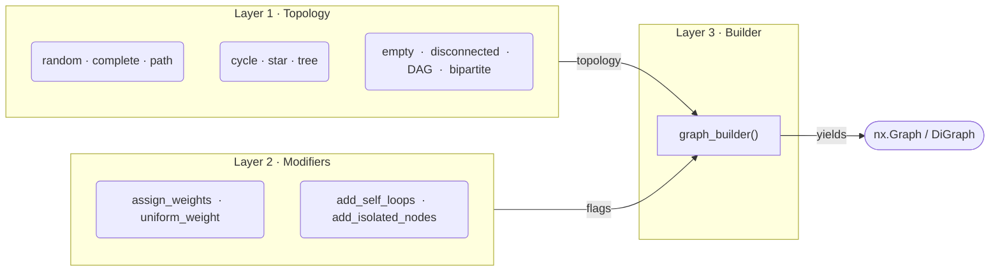
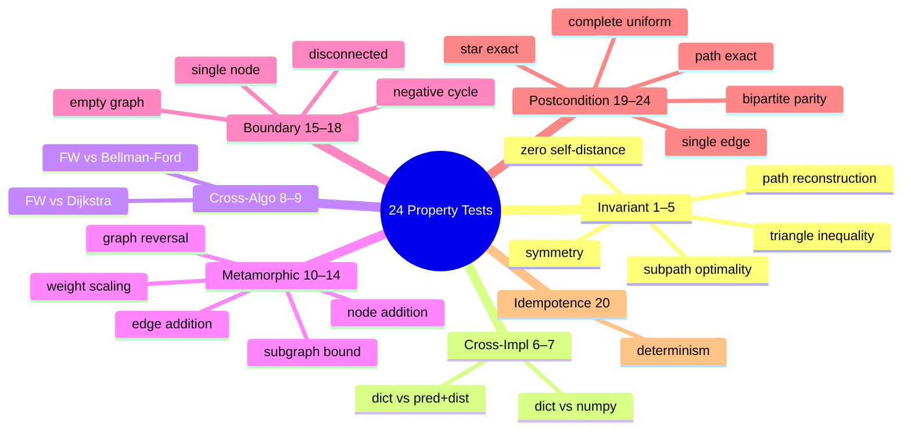
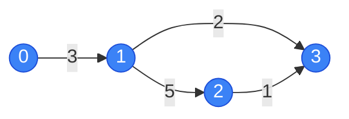
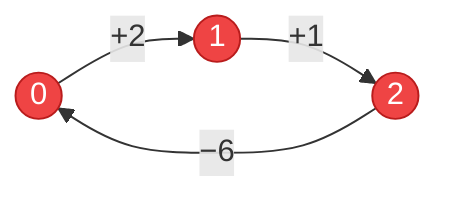
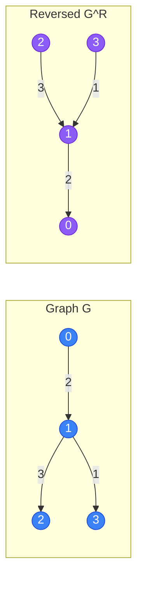
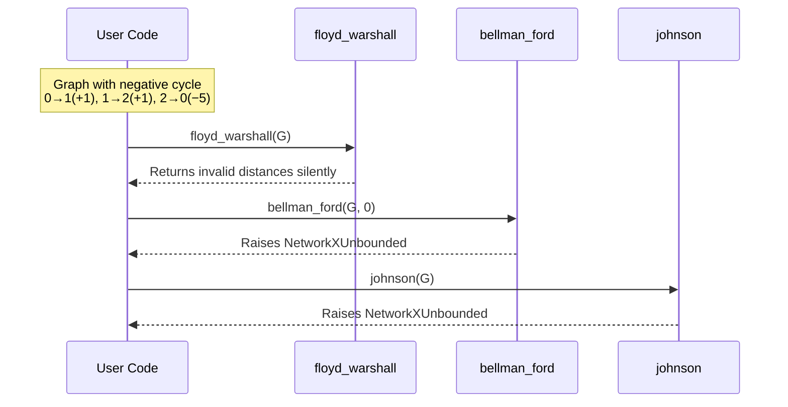

# Property-Based Testing: Floyd-Warshall All-Pairs Shortest Paths

- **Course:** E0 251o Data Structures & Graph Analytics (2026)
- **Author:** Brijgopal Bharadwaj (`brijgopalb@iisc.ac.in`)

---

## What This Project Does

This project uses [Hypothesis](https://hypothesis.readthedocs.io/) to property-test NetworkX's **Floyd-Warshall** implementation — the O(V³) all-pairs shortest-path algorithm from [`networkx.algorithms.shortest_paths.dense`](https://github.com/networkx/networkx/blob/main/networkx/algorithms/shortest_paths/dense.py). It ships **24 property-based tests** and **1 bug discovery**, all in a single self-contained Python file.

**Functions under test:**

| Function | Returns |
|---|---|
| `nx.floyd_warshall(G)` | `dict[dict]` of distances |
| `nx.floyd_warshall_predecessor_and_distance(G)` | `(predecessors, distances)` dicts |
| `nx.floyd_warshall_numpy(G, nodelist)` | NumPy distance matrix |
| `nx.reconstruct_path(source, target, pred)` | Shortest-path node list |

---

## Quick Start

```bash
pip install -r requirements.txt
pytest test_floyd_warshall.py -v
```

For Hypothesis coverage statistics (`event()` and `target()` output):

```bash
pytest test_floyd_warshall.py -v --hypothesis-show-statistics
```

> Tested on **NetworkX 3.6.1**, **Hypothesis >= 6.0**, **NumPy >= 1.24**, **Python 3.12**.

---

## Graph Generation: A Three-Layer Architecture

Rather than hand-crafting graphs, every test draws from a composable strategy library built in three layers:



**Layer 1** provides 10 topology strategies, each with a uniform `(draw, min_nodes, max_nodes, directed)` signature so they're plug-and-play. **Layer 2** mutates graphs in-place (weights, self-loops, isolates). **Layer 3** is `graph_builder()` — a single composable entry-point:

```python
@given(G=graph_builder())                                    # mixed topologies, positive weights
@given(G=graph_builder(topology=cycle_graph_topology))       # specific topology
@given(G=graph_builder(directed=False, min_weight=0))        # undirected, non-negative
@given(G=graph_builder(self_loops=True, isolated_nodes=True))# structural edge-cases
```

Two **standalone strategies** have bespoke logic that doesn't fit the builder: `dag_with_weights` (negative edges on a cycle-free DAG) and `negative_cycle_digraph` (Hamiltonian cycle forced negative).

### Why functions, not classes?

Hypothesis strategies are first-class objects that compose natively via `draw()`, `st.one_of()`, and `st.flatmap()`. Wrapping them in a class would add indirection without improving composability — matching the pattern used by Hypothesis itself, `hypothesis-networkx`, and NetworkX's own test suite.

### Edge-Case Coverage

An empirical audit confirmed the strategy library generates every structural edge case that matters for Floyd-Warshall correctness:

| Edge Case | How Generated | Why It Matters |
|---|---|---|
| Self-loops | `self_loops=True` | Positive self-loop must not change dist(v,v)=0 |
| Isolated nodes | `isolated_nodes=True` | Must produce dist(iso,v) = ∞ for v ≠ iso |
| Uniform weights | `uniform_weight=True` | Degenerate case where BFS-equivalence holds |
| Zero-weight edges | `min_weight=0` | Boundary for non-negative weight assumptions |
| Negative edges (no neg cycle) | `dag_with_weights` | DAG structure guarantees safety |
| Negative cycles | `negative_cycle_digraph` | Must produce dist(v,v) < 0 on cycle nodes |
| Disconnected components | `disconnected_graph_topology` | Cross-component dist must be ∞ |
| Empty graph (0 edges) | `empty_graph_topology` | Degenerate boundary case |
| Bipartite structure | `bipartite_graph_topology` | Restricted connectivity with parity invariants |

---

## The 24 Property Tests

Each test has a detailed docstring covering: (1) what property is tested, (2) mathematical basis, (3) test strategy, (4) assumptions, and (5) why failure matters.



### Invariant Properties

| # | Test | Property | Generator |
|---|------|----------|-----------|
| 1 | `test_zero_self_distance` | dist(v,v) = 0 when no negative cycles | `graph_builder()` + `@example` (self-loop) |
| 2 | `test_triangle_inequality` | dist(u,w) ≤ dist(u,v) + dist(v,w) | `dag_with_weights()` + `target()` |
| 3 | `test_symmetry_undirected` | dist(u,v) = dist(v,u) on undirected graphs | `graph_builder(directed=False)` |
| 4 | `test_path_weight_equals_distance` | Reconstructed path weight = reported dist | `graph_builder(topology=random_graph_topology)` |
| 5 | `test_subpath_optimality` | Every sub-path of a shortest path is optimal | `graph_builder(topology=random_graph_topology)` |

### Cross-Implementation Consistency

| # | Test | Property | Generator |
|---|------|----------|-----------|
| 6 | `test_fw_dict_vs_pred_dist` | `floyd_warshall` = `floyd_warshall_predecessor_and_distance` | `dag_with_weights()` |
| 7 | `test_fw_dict_vs_numpy` | Dict distances = NumPy matrix distances | `graph_builder(topology=random_graph_topology)` |

### Cross-Algorithm Validation (Differential Testing)

| # | Test | Property | Generator |
|---|------|----------|-----------|
| 8 | `test_fw_vs_dijkstra` | FW = Dijkstra (non-negative weights) | `graph_builder(...)` + `event()` |
| 9 | `test_fw_vs_bellman_ford` | FW = Bellman-Ford (negative weights, no neg cycles) | `dag_with_weights()` |

### Metamorphic Properties

| # | Test | Property | Generator |
|---|------|----------|-----------|
| 10 | `test_weight_scaling` | Scale weights by k → scale distances by k | `graph_builder(...)` |
| 11 | `test_edge_addition_monotonicity` | Adding non-negative edge can only decrease distances | `graph_builder(min_weight=0)` + `data.draw()` |
| 12 | `test_subgraph_distance_lower_bound` | dist_G(u,v) ≤ dist_H(u,v) for subgraph H ⊆ G | `graph_builder(...)` + `data.draw()` |
| 13 | `test_graph_reversal_transposes_distances` | dist_G(u,v) = dist_{G^R}(v,u) | `dag_with_weights()` |
| 14 | `test_node_addition_invariance` | Adding isolated node preserves all distances | `graph_builder(...)` |

### Boundary / Edge-Case Properties

| # | Test | Property | Generator |
|---|------|----------|-----------|
| 15 | `test_single_node_self_distance` | Single node: dist(v,v) = 0 | Parametric on `node_id` |
| 16 | `test_empty_graph_distances` | Zero edges: diagonal=0, off-diagonal=∞ | `empty_graph_topology()` |
| 17 | `test_disconnected_components` | Cross-component distances are ∞ | `graph_builder(topology=disconnected_graph_topology)` |
| 18 | `test_negative_cycle_detection` | Negative cycle → dist(u,u) < 0 | `negative_cycle_digraph()` |

### Postcondition Properties

| # | Test | Property | Generator |
|---|------|----------|-----------|
| 19 | `test_complete_graph_uniform_weight` | K_n with uniform weight w → dist(u,v) = w for u≠v | Parametric on `n`, `w` |
| 21 | `test_path_graph_exact_distances` | Directed path: dist = prefix-sum; reverse = ∞ | Parametric on `weights` list |
| 22 | `test_star_graph_exact_distances` | Directed star: hub→leaf = spoke weight; all else = ∞ | Parametric on `spoke_weights` |
| 23 | `test_single_edge_exact_distances` | One edge (u,v,w): dist(u,v)=w; dist(v,u)=∞ | Parametric on `u`, `v`, `w` |
| 24 | `test_bipartite_parity_of_distances` | Bipartite + unit weights: parity of dist matches partition membership | `bipartite_graph_topology(directed=False)` |

### Idempotence / Determinism

| # | Test | Property | Generator |
|---|------|----------|-----------|
| 20 | `test_idempotence` | FW twice on same graph → identical output | `graph_builder(...)` |

---

## Illustrative Examples

### Triangle Inequality on a DAG with Shortcuts (Tests 1, 2)

The 2-hop path 1→2→3 costs 6, but the direct edge 1→3 costs 2. Floyd-Warshall must prefer the shortcut.



```python
dist = nx.floyd_warshall(G)
# dist[0][0] = 0     ← Test 1: zero self-distance
# dist[1][3] = 2     ← direct edge beats 2-hop (5+1=6)
# dist[0][3] = 5     ← 0→1(3) + 1→3(2)
# Triangle inequality: dist[0][3] ≤ dist[0][1] + dist[1][3]  →  5 ≤ 3+2  ✓
```

### Negative Cycle Produces Negative Self-Distance (Test 18)

The cycle 0→1→2→0 has total weight 2+1−6 = **−3**. Floyd-Warshall computes shortest *walks*, so traversing the cycle drives every on-cycle node's self-distance below zero.



```python
dist = nx.floyd_warshall(G)
# dist[0][0] = -3, dist[1][1] = -3, dist[2][2] = -3
# All cycle nodes get negative self-distance — the observable signal for a negative cycle.
```

This is also the setup for the **bug discovery** below: Floyd-Warshall detects the negative cycle in the diagonal but never *tells* the user about it.

### Graph Reversal Transposes the Distance Matrix (Test 13)

Flipping every edge creates a bijection between u→v paths in G and v→u paths in G^R. This metamorphic property must hold for *every* node pair.



```python
dist_G  = nx.floyd_warshall(G)
dist_GR = nx.floyd_warshall(G.reverse())

# dist_G[0][2]  = 5    dist_GR[2][0]  = 5   ← transpose equality ✓
# dist_G[0][3]  = 3    dist_GR[3][0]  = 3   ✓
# dist_G[2][0]  = inf  dist_GR[0][2]  = inf ✓ (no return path in either direction)
```

---

## Bug Discovery: Silent Failure on Negative Cycles

Floyd-Warshall silently returns invalid distances on negative-weight cycles. In contrast, Bellman-Ford and Johnson raise `NetworkXUnbounded`.



**Root cause:** The triple-nested relaxation loop in `dense.py` (lines 160–168) ends and returns at line 169 with no post-loop diagonal check. The docstring says the algorithm "can still fail" on negative cycles but never specifies *how*, and there's no exception, no warning.

**Suggested fix** — a single O(n) scan after the O(n³) loop:

```python
if any(dist[v][v] < 0 for v in G):
    raise nx.NetworkXUnbounded("Negative cycle detected in floyd_warshall.")
```

**Impact:** A user migrating from Bellman-Ford to Floyd-Warshall silently loses negative-cycle protection. The returned distances look structurally valid (same `dict[dict]` format) but contain meaningless values.

**Verified on:** NetworkX 3.6.1, Python 3.12.10 — all three FW variants affected.

---

## Hypothesis Features Used

| Feature | Where | Purpose |
|---|---|---|
| `@st.composite` | All graph strategies | Build complex graph objects from primitive draws |
| `@given` | All property tests | Generate random inputs |
| `@example` | Test 1 (self-loop graph) | Pin important edge cases |
| `@settings` | All tests | Control `max_examples` and `suppress_health_check` |
| `assume()` | Tests 11, 12, 17, 23 | Skip invalid inputs (no non-edges, too few edges, single component, u=v) |
| `st.data()` | Tests 11, 12 | Draw values dependent on the generated graph for proper shrinking |
| `event()` | Tests 1, 8 | Track topology/size distribution for coverage analysis |
| `target()` | Test 2 | Guide generation toward denser DAGs |

---

## Design Decisions

1. **Single file.** The rubric requires all imports, strategies, helpers, and tests in one Python file. Graph generation lives at the top of `test_floyd_warshall.py`.

2. **Three-layer strategy architecture.** Separating topology, modifiers, and the builder means each layer is independently testable. Adding a new topology or modifier doesn't touch existing code.

3. **DAGs for negative-weight testing.** Rather than generating random graphs and filtering for acyclicity (wasting test budget), `dag_topology` guarantees no cycles by construction — edges only go from lower to higher index.

4. **Cross-algorithm differential testing (Tests 8–9).** Validating FW against Dijkstra and Bellman-Ford — fundamentally different algorithms solving the same problem — provides stronger evidence than comparing three implementations of FW itself.

5. **Hypothesis-controlled randomness.** Tests 11 and 12 use `st.data().draw()` instead of Python's `random` module so Hypothesis can shrink failing examples to minimal counterexamples.

6. **Adapted to installed NetworkX behaviour.** NetworkX 3.6.1 does not raise exceptions for negative cycles — it returns negative diagonal entries. Test 18 checks this actual behaviour; the bug discovery test documents the API inconsistency.

---

## Project Structure

```
brijgopalb@iisc.ac.in/
├── test_floyd_warshall.py   # Strategies + 24 property tests + bug discovery
├── requirements.txt         # Python dependencies
├── .gitignore               # Excludes __pycache__, .hypothesis/, .pytest_cache/
└── README.md                # This file
```
