# Property-Based Testing: Max-Flow / Min-Cut Algorithms

**Course:** E0 251o Data Structures & Graph Analytics (2026)
**Team member:** M Chandan Kumar Rao (`chandankuma4@iisc.ac.in`, SR No. 24650)

## Table of Contents

- [Project Overview](#project-overview)
- [Theoretical Background](#theoretical-background)
- [Algorithms Under Test](#algorithms-under-test)
- [Example Graphs](#example-graphs)
- [Test Suite Overview](#test-suite-overview)
- [Test Descriptions](#test-descriptions)
- [Graph Generation Strategies](#graph-generation-strategies)
- [How to Run](#how-to-run)
- [Bug Discovery](#bug-discovery)
- [References](#references)

---

## Project Overview

This project implements **20 property-based tests** (Tests 1–20) plus **1 bug-discovery test** using the [Hypothesis](https://hypothesis.readthedocs.io/) library to verify the correctness of **NetworkX's max-flow and min-cut** algorithms. Rather than checking specific input/output pairs, property-based testing asserts *universal invariants* that must hold for **all** valid inputs — catching edge cases that hand-written examples miss.

### Algorithms Tested

| NetworkX Function | Purpose |
|---|---|
| `nx.maximum_flow(G, s, t)` | Returns max-flow value **and** per-edge flow dict |
| `nx.maximum_flow_value(G, s, t)` | Returns only the max-flow value |
| `nx.minimum_cut(G, s, t)` | Returns min-cut value **and** the partition (S, T) |
| `nx.minimum_cut_value(G, s, t)` | Returns only the min-cut value |

### Tech Stack

| Tool | Role |
|---|---|
| Python 3.12+ | Language |
| NetworkX | Graph algorithms library |
| Hypothesis | Property-based test generation |
| pytest | Test runner |

---

## Theoretical Background

### What is a Flow Network?

A **flow network** is a directed graph `G = (V, E)` where:
- Each edge `(u, v)` has a non-negative **capacity** `c(u, v) ≥ 0`
- There is a designated **source** node `s` and **sink** node `t`
- A **flow** assigns a value `f(u, v)` to each edge satisfying two constraints

### The Two Axioms of Network Flow

```
1. Capacity Constraint:   0 ≤ f(u,v) ≤ c(u,v)    for every edge (u,v)
2. Flow Conservation:     Σ f(u,v) = Σ f(v,w)     for every node v ≠ s, t
                         (inflow)    (outflow)
```

### Maximum Flow

The **maximum flow** is the largest total flow that can be sent from `s` to `t` while respecting all capacity constraints and flow conservation.

### Minimum Cut

An **s-t cut** is a partition of nodes into two sets `(S, T)` where `s ∈ S` and `t ∈ T`. The **capacity** of the cut is:

```
cap(S, T) = Σ c(u,v)   for all edges (u,v) where u ∈ S and v ∈ T
```

The **minimum cut** is the cut with the smallest capacity.

### The Max-Flow Min-Cut Theorem

> **Theorem (Ford & Fulkerson, 1956):** In any flow network, the value of the maximum flow from source to sink equals the capacity of the minimum cut separating source and sink.
>
> ```
> max |f| = min cap(S, T)
> ```

This is the central theorem that our test suite verifies.

---

## Example Graphs

### Example 1: Simple Two-Path Network

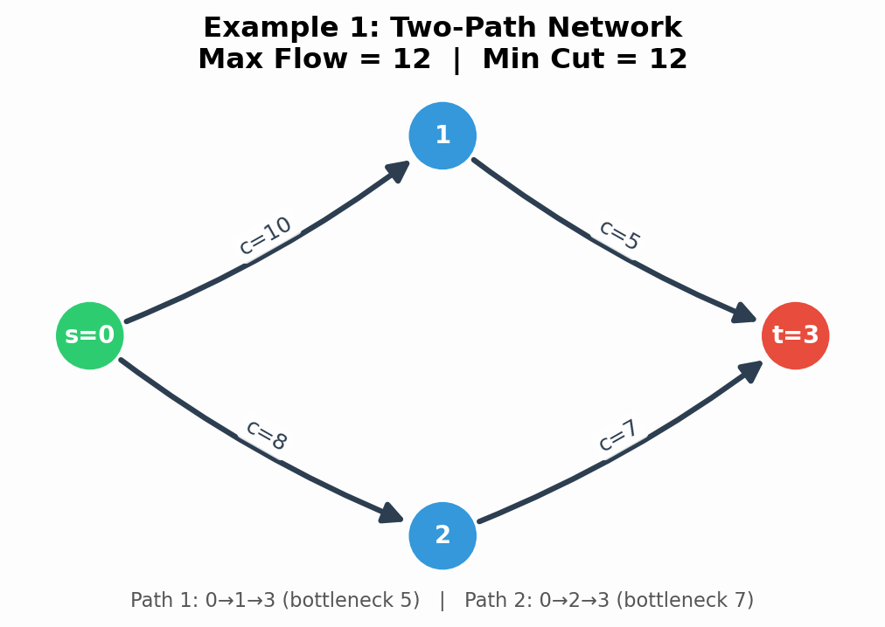

**Analysis:**
- **Path 1:** `0 → 1 → 3` — bottleneck = min(10, 5) = **5**
- **Path 2:** `0 → 2 → 3` — bottleneck = min(8, 7) = **7**
- **Max Flow = 5 + 7 = 12**
- **Min Cut:** Edges `{(1,3), (2,3)}` with capacities 5 + 7 = **12** ✓

```python
G = nx.DiGraph()
G.add_edge(0, 1, capacity=10)
G.add_edge(1, 3, capacity=5)
G.add_edge(0, 2, capacity=8)
G.add_edge(2, 3, capacity=7)

flow_val = nx.maximum_flow_value(G, 0, 3)   # → 12
cut_val  = nx.minimum_cut_value(G, 0, 3)    # → 12  (theorem holds)
```

### Example 2: Single-Path Bottleneck

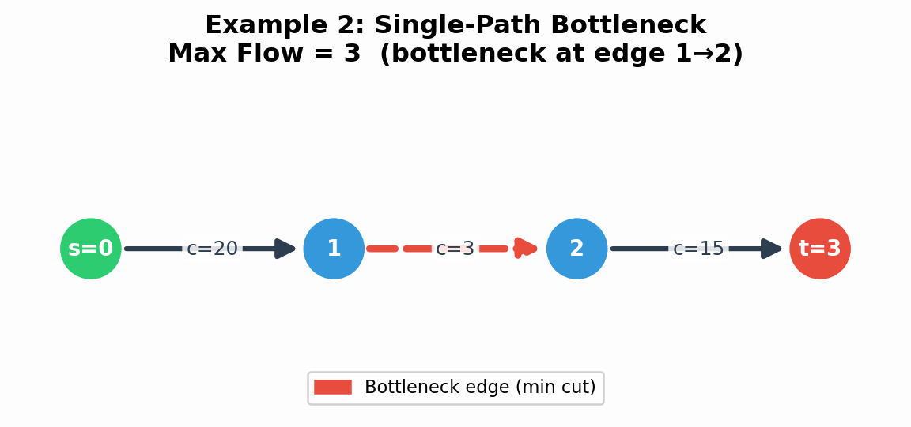

**Analysis:**
- Only one path: `0 → 1 → 2 → 3`
- **Bottleneck** = min(20, 3, 15) = **3**
- Max flow = **3**, limited entirely by edge `(1, 2)` (shown dashed in red)
- Min cut = edge `{(1, 2)}` with capacity **3** ✓

This is what **Test 8 (test_single_path_bottleneck)** verifies.

### Example 3: Disconnected Source and Sink

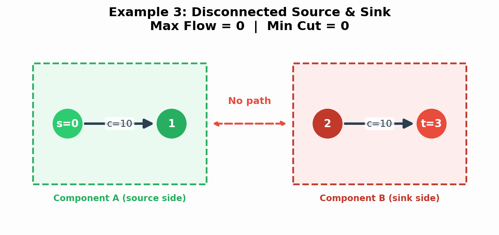

**Analysis:**
- No path from `s=0` to `t=3` — the two components are completely isolated
- **Max flow = 0**, **Min cut = 0**
- The trivial cut `S={0,1}, T={2,3}` has zero crossing capacity

This is what **Test 10 (test_disconnected_source_sink)** verifies.

### Example 4: Diamond Graph (Shared Intermediate Nodes)

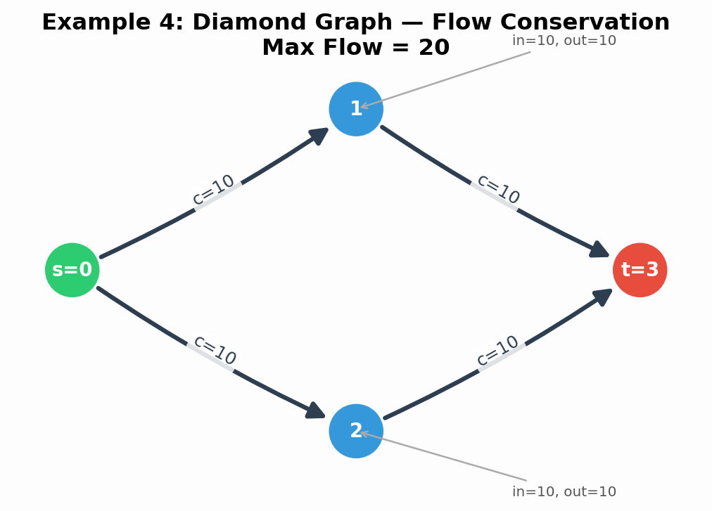

**Analysis:**
- Two parallel paths, each with bottleneck 10
- **Max flow = 20**
- **Flow conservation at nodes 1 and 2:** inflow = outflow = 10 each (annotated in the diagram)

This topology tests **Test 2 (flow conservation)** and **Test 4 (source/sink balance)**.

### Example 5: Capacity Scaling (Metamorphic Property)

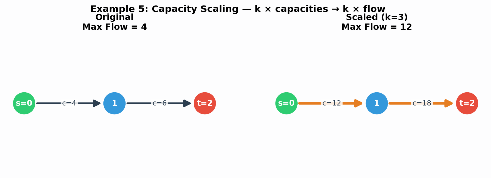

Multiplying all capacities by `k` multiplies the max flow by `k`. The left panel shows the original graph (max flow = 4), and the right panel shows the same graph with all capacities tripled (max flow = 12 = 3 × 4). This is what **Test 7 (test_capacity_scaling)** verifies.

### Example 6: Monotonicity — Increasing Capacity

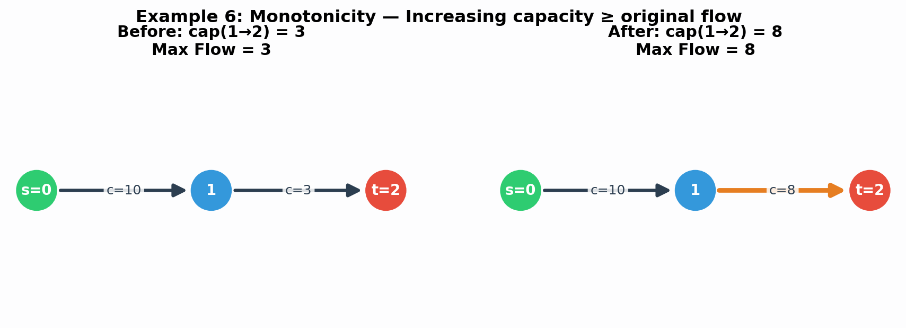

Increasing any edge's capacity can never decrease the max flow. The modified edge `(1→2)` is highlighted in orange in the "After" panel. This is **Test 6 (test_monotonicity_of_max_flow)**.

### Example 7: Adding a Parallel Path (Superadditivity)

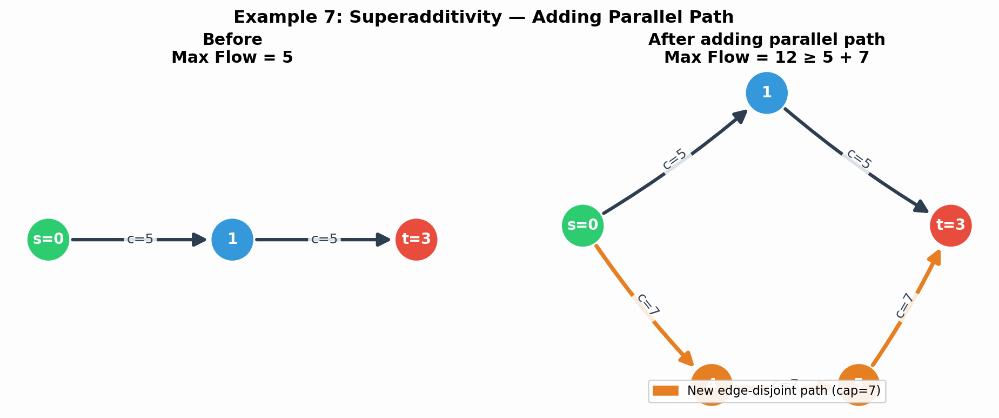

The left panel shows the original graph (max flow = 5). The right panel adds an edge-disjoint path through fresh nodes 4 and 5 (shown in orange), each with capacity 7. The new max flow = 12 ≥ 5 + 7. This is **Test 12 (test_adding_parallel_path_increases_flow)**.

### Example 8: Weak Duality — Every Cut Upper-Bounds the Flow

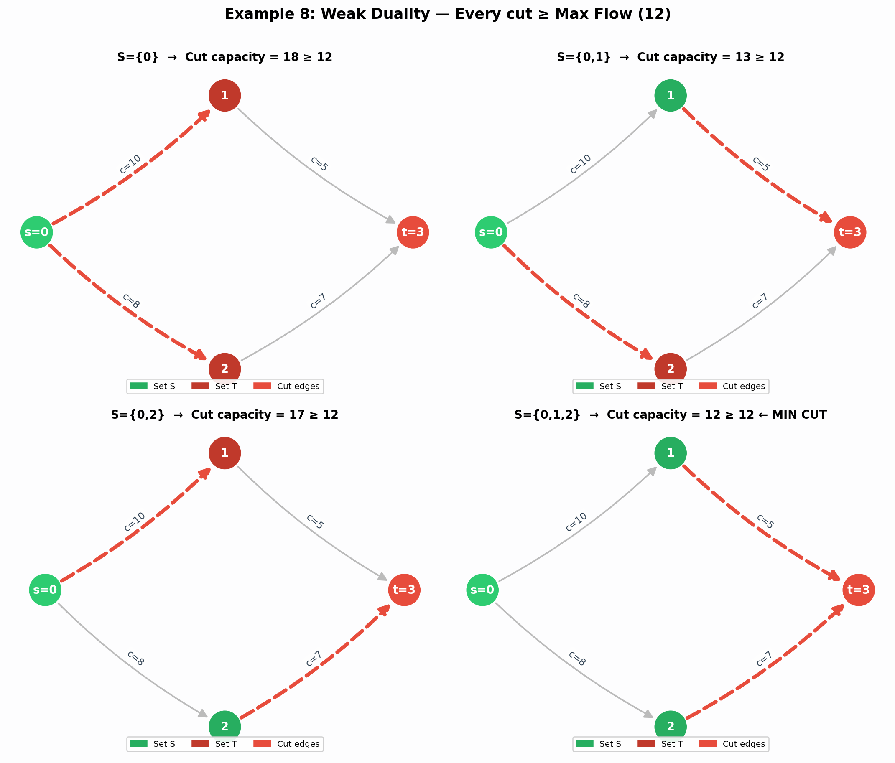

All four possible s-t cuts are shown. In each sub-plot, green nodes belong to set **S** and red nodes to set **T**. Dashed red edges are the cut edges whose capacities sum to the cut value. Every cut capacity ≥ max flow (12), and the bottom-right panel (`S={0,1,2}`) achieves equality — that is the **minimum cut**.

**Test 15 (test_weak_duality)** checks that max flow ≤ every random cut.

### Example 9: Cross-Algorithm Consensus

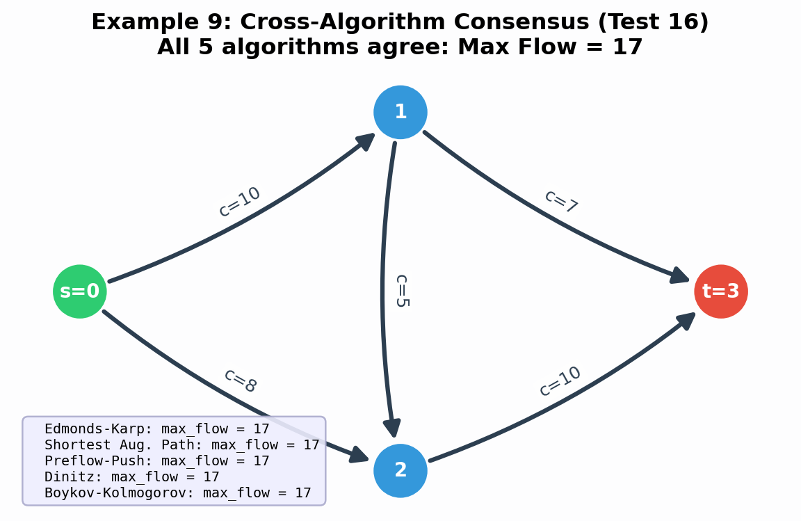

All five NetworkX max-flow algorithms (Edmonds-Karp, Shortest Augmenting Path, Preflow-Push, Dinitz, Boykov-Kolmogorov) must return the same value on any input. This is **Test 16 (test_all_algorithms_agree)**.

### Example 10: No Augmenting Path in Residual Graph

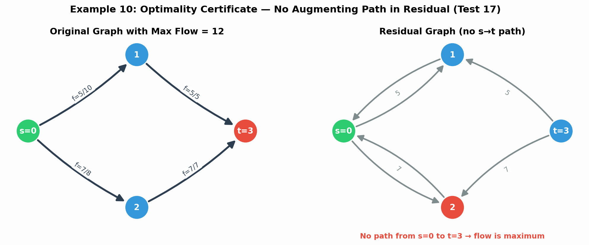

After computing max flow, the residual graph has no s→t path — this is the Ford-Fulkerson optimality certificate. The left panel shows the original graph with flow assignments; the right panel shows the residual graph with no path from source to sink. This is **Test 17 (test_no_augmenting_path_in_residual)**.

### Example 11: Complementary Slackness

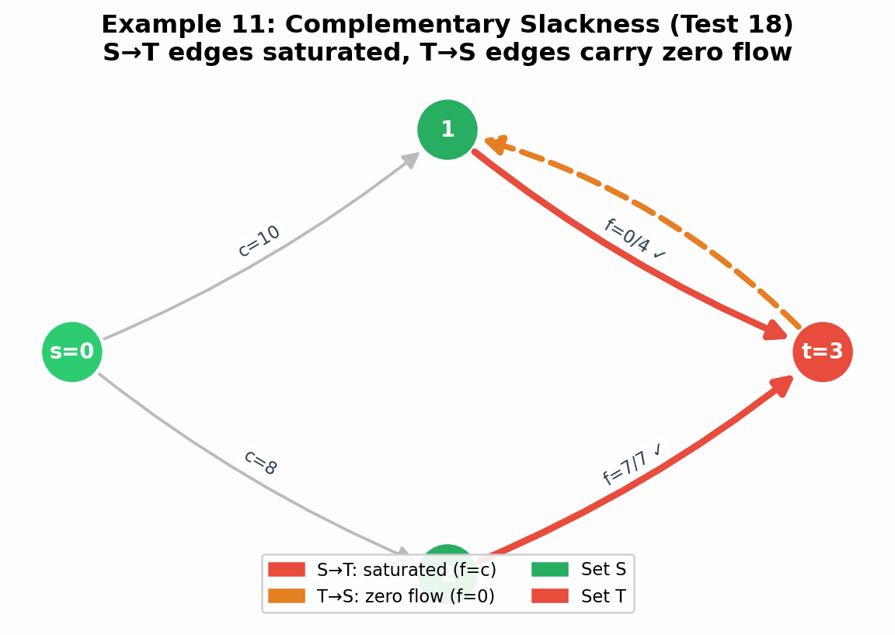

In an optimal flow/cut pair, forward cut edges (S→T) are fully saturated and backward cut edges (T→S) carry zero flow. This is the LP duality condition verified by **Test 18 (test_mincut_complementary_slackness)**.

### Example 12: Edge-Reversal Symmetry

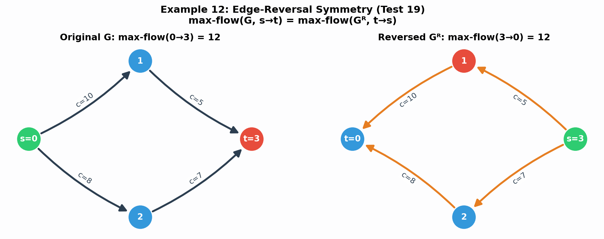

Reversing all edges and swapping source/sink preserves the max-flow value. The left panel shows the original graph (max flow = 12), the right panel shows the reversed graph Gᴿ with swapped source/sink (max flow = 12). This is **Test 19 (test_edge_reversal_symmetry)**.

### Example 13: Gomory-Hu Tree

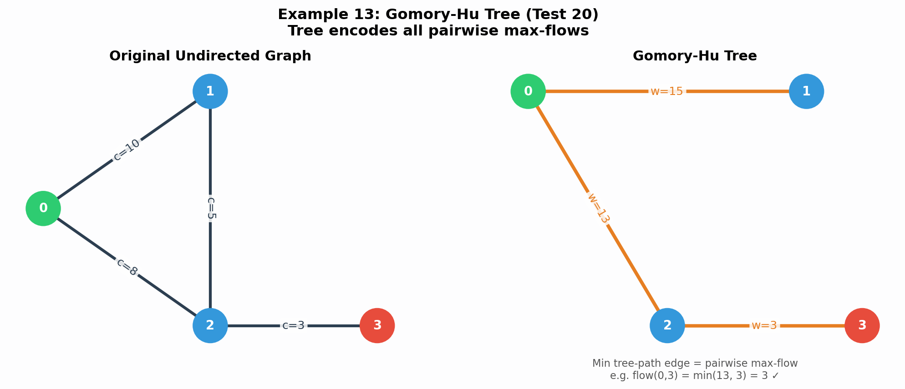

The Gomory-Hu tree (right) encodes all O(n²) pairwise max-flow values of the original undirected graph (left) in just n-1 edges. The minimum edge weight on any tree path equals the max-flow between those endpoints. This is **Test 20 (test_gomory_hu_tree)**.

---

## Test Suite Overview

| # | Test Name | Property Type | What It Verifies |
|---|---|---|---|
| 1 | `test_maxflow_equals_mincut` | **Invariant** | Max-Flow Min-Cut Theorem: `max_flow = min_cut` |
| 2 | `test_flow_conservation` | **Invariant** | Flow in = Flow out at every intermediate node |
| 3 | `test_capacity_constraints` | **Postcondition** | `0 ≤ f(e) ≤ c(e)` for all edges |
| 4 | `test_source_outflow_equals_sink_inflow` | **Invariant** | Net source outflow = net sink inflow = flow value |
| 5 | `test_mincut_partition_validity` | **Postcondition** | Cut partition is valid and capacity matches |
| 6 | `test_monotonicity_of_max_flow` | **Metamorphic** | Increasing capacity cannot decrease flow |
| 7 | `test_capacity_scaling` | **Metamorphic** | Scaling all capacities by k scales flow by k |
| 8 | `test_single_path_bottleneck` | **Postcondition** | Single-path flow = min edge capacity |
| 9 | `test_idempotence` | **Idempotence** | Same input → same output, twice |
| 10 | `test_disconnected_source_sink` | **Boundary** | No s-t path → flow = 0 |
| 11 | `test_single_node_graph` | **Boundary** | Source = sink edge case |
| 12 | `test_adding_parallel_path_increases_flow` | **Metamorphic** | Edge-disjoint path adds its bottleneck |
| 13 | `test_removing_edge_cannot_increase_flow` | **Metamorphic** | Removing edge cannot increase flow |
| 14 | `test_complete_graph_lower_bound` | **Postcondition** | Flow ≥ direct s→t edge capacity |
| 15 | `test_weak_duality` | **Invariant** | Flow ≤ every possible cut capacity |
| 16 | `test_all_algorithms_agree` | **Differential** | All 5 flow algorithms (Edmonds-Karp, Shortest Augmenting Path, Preflow-Push, Dinitz, Boykov-Kolmogorov) return the same value |
| 17 | `test_no_augmenting_path_in_residual` | **Optimality Certificate** | No s-t path exists in the residual graph after max flow |
| 18 | `test_mincut_complementary_slackness` | **LP Duality** | Forward cut edges are saturated; backward cut edges carry zero flow |
| 19 | `test_edge_reversal_symmetry` | **Symmetry** | max-flow(G, s→t) = max-flow(Gᴿ, t→s) under edge reversal |
| 20 | `test_gomory_hu_tree` | **Structural** | Min edge on Gomory-Hu tree path = pairwise max-flow (undirected) |

---

## Test Descriptions

### Test 1 — Max-Flow Min-Cut Theorem (`test_maxflow_equals_mincut`)

**Property type:** Core Invariant

**What it tests:** The most fundamental theorem in network flow — that the maximum flow value from source to sink exactly equals the minimum cut capacity separating them.

**Mathematical basis:** Ford & Fulkerson (1956) proved that `max |f| = min cap(S,T)`. This duality is the cornerstone of all max-flow algorithms. If this fails, the entire algorithm is broken.

**Graph generation:** Random directed graphs with 3–15 nodes, guaranteed s-t connectivity, positive integer capacities (1–100), and random additional edges.

**Failure means:** Either the max-flow or min-cut computation is fundamentally incorrect.

---

### Test 2 — Flow Conservation (`test_flow_conservation`)

**Property type:** Invariant

**What it tests:** At every intermediate node (not source or sink), total inflow = total outflow. This is Kirchhoff's current law for networks.

**Mathematical basis:** Flow conservation is an axiom: `Σ_u f(u,v) = Σ_w f(v,w)` for all `v ∉ {s,t}`. No node can create or destroy flow.

**Graph generation:** Same random flow networks as Test 1.

**Failure means:** The algorithm produced an invalid (infeasible) flow assignment.

---

### Test 3 — Capacity Constraints (`test_capacity_constraints`)

**Property type:** Postcondition

**What it tests:** Every edge's flow is between 0 and its capacity: `0 ≤ f(u,v) ≤ c(u,v)`.

**Mathematical basis:** This is the second axiom of network flow. Violating it means sending more through a pipe than it can handle.

**Failure means:** The algorithm returned an infeasible solution.

---

### Test 4 — Source/Sink Balance (`test_source_outflow_equals_sink_inflow`)

**Property type:** Invariant

**What it tests:** Net flow leaving source = net flow entering sink = reported max-flow value. A three-way consistency check.

**Mathematical basis:** Follows directly from flow conservation summed over all intermediate nodes.

**Failure means:** The reported flow value is inconsistent with the actual flow assignment.

---

### Test 5 — Min-Cut Partition Validity (`test_mincut_partition_validity`)

**Property type:** Postcondition

**What it tests:** The returned partition `(S, T)` satisfies: `s ∈ S`, `t ∈ T`, `S ∪ T = V`, `S ∩ T = ∅`, and the sum of capacities of edges from S to T equals the reported cut value.

**Failure means:** The min-cut algorithm returns a structurally invalid or numerically incorrect partition.

---

### Test 6 — Monotonicity (`test_monotonicity_of_max_flow`)

**Property type:** Metamorphic

**What it tests:** Increasing any single edge's capacity cannot decrease the max flow.

**Mathematical basis:** Relaxing a constraint in a linear programme can only improve (or maintain) the objective. The feasible region grows, so the optimum is non-decreasing.

**Failure means:** The algorithm is incorrectly sensitive to capacity changes.

---

### Test 7 — Capacity Scaling (`test_capacity_scaling`)

**Property type:** Metamorphic

**What it tests:** Multiplying all edge capacities by `k` multiplies the max flow by exactly `k`.

**Mathematical basis:** The max-flow LP scales linearly: if `f*` is optimal for capacities `c`, then `k·f*` is optimal for capacities `k·c`.

**Failure means:** The algorithm does not respect the linear structure of the problem.

---

### Test 8 — Single-Path Bottleneck (`test_single_path_bottleneck`)

**Property type:** Postcondition

**What it tests:** On a simple path graph `0 → 1 → … → n-1`, max flow = minimum edge capacity.

**Mathematical basis:** With exactly one s-t path, the flow is limited by the tightest edge (the bottleneck).

**Graph generation:** Simple directed paths of length 2–10 with random capacities.

**Failure means:** The algorithm fails on the simplest possible topology.

---

### Test 9 — Idempotence (`test_idempotence`)

**Property type:** Idempotence

**What it tests:** Running `maximum_flow` twice on the same unmodified graph produces identical results (both value and flow dict).

**Failure means:** Non-determinism or unintended internal state mutation.

---

### Test 10 — Disconnected Graph (`test_disconnected_source_sink`)

**Property type:** Boundary Condition

**What it tests:** When source and sink are in different connected components, max flow = 0 and min cut = 0.

**Graph generation:** Two disconnected chain subgraphs with no cross-edges.

**Failure means:** The algorithm incorrectly reports flow through a non-existent path.

---

### Test 11 — Single Node (`test_single_node_graph`)

**Property type:** Boundary Condition

**What it tests:** When source = sink (single-node graph), NetworkX raises `NetworkXError` (or returns 0).

**Failure means:** The API contract for degenerate inputs has changed.

---

### Test 12 — Superadditivity (`test_adding_parallel_path_increases_flow`)

**Property type:** Metamorphic

**What it tests:** Adding an edge-disjoint s-t path through fresh nodes increases max flow by at least the new path's bottleneck.

**Mathematical basis:** The new path is an independent augmenting path. Its bottleneck capacity is additive to the existing max flow.

**Failure means:** The algorithm fails to find an obvious augmenting path.

---

### Test 13 — Edge Removal (`test_removing_edge_cannot_increase_flow`)

**Property type:** Metamorphic

**What it tests:** Removing any edge cannot increase the max flow (equivalent to setting its capacity to 0).

**Mathematical basis:** A more constrained problem cannot have a better optimum.

**Failure means:** Violates fundamental optimisation monotonicity.

---

### Test 14 — Complete Graph Lower Bound (`test_complete_graph_lower_bound`)

**Property type:** Postcondition

**What it tests:** In a complete directed graph, max flow ≥ capacity of the direct `s → t` edge.

**Mathematical basis:** The direct edge alone is a feasible flow. The optimum must be at least as good.

**Failure means:** The algorithm misses even the most trivial feasible solution.

---

### Test 15 — Weak Duality (`test_weak_duality`)

**Property type:** Invariant

**What it tests:** Max flow ≤ capacity of *every* possible s-t cut (not just the minimum one).

**Mathematical basis:** Weak LP duality: any feasible primal solution ≤ any feasible dual solution. The max flow is bounded above by every cut.

**Failure means:** The flow exceeds a cut, which is mathematically impossible.

---

### Test 16 — Cross-Algorithm Consensus (`test_all_algorithms_agree`)

**Property type:** Differential / N-Version Testing

**What it tests:** All five max-flow implementations in NetworkX (Edmonds-Karp, Shortest Augmenting Path, Preflow-Push, Dinitz, Boykov-Kolmogorov) return the same max-flow value on any input.

**Mathematical basis:** The max-flow value is unique (it is the optimum of a linear programme). Different algorithms may find different flow decompositions, but the objective value must be identical. This is *differential testing* -- instead of checking against a known oracle, we check that independent implementations agree. A bug would have to be identical across all five fundamentally different codepaths to escape detection.

**Failure means:** At least one of the five algorithm implementations has a correctness bug.

---

### Test 17 — No Augmenting Path in Residual (`test_no_augmenting_path_in_residual`)

**Property type:** Optimality Certificate

**What it tests:** After computing max flow, the residual graph contains no directed path from source to sink.

**Mathematical basis:** The Augmenting Path Theorem (corollary of Max-Flow Min-Cut) states that a flow is maximum iff no augmenting path exists in the residual graph. This is the termination condition of Ford-Fulkerson and serves as an independently verifiable optimality certificate. Rather than just checking the flow value, this reconstructs the residual graph from the flow decomposition and verifies the theoretical optimality condition directly.

**Failure means:** The flow is not maximum — additional flow could be pushed.

---

### Test 18 — Complementary Slackness (`test_mincut_complementary_slackness`)

**Property type:** LP Duality (Complementary Slackness)

**What it tests:** In an optimal max-flow/min-cut pair: (1) every forward edge crossing the cut (S→T) is fully saturated, and (2) every backward edge (T→S) carries zero flow.

**Mathematical basis:** This is the complementary slackness condition from LP duality. Strong duality (max flow = min cut) holds, and complementary slackness gives the precise primal-dual relationship: `f(u,v) = c(u,v)` for S→T edges, `f(u,v) = 0` for T→S edges. This verifies the structural relationship between the flow and cut solutions, not just their values -- a much stronger check than value equality alone.

**Failure means:** The flow and cut are not a valid primal-dual optimal pair.

---

### Test 19 — Edge-Reversal Symmetry (`test_edge_reversal_symmetry`)

**Property type:** Symmetry / Metamorphic

**What it tests:** Reversing every edge and swapping source/sink preserves the max-flow value: `max-flow(G, s→t) = max-flow(Gᴿ, t→s)`.

**Mathematical basis:** Any feasible flow f in G can be mirrored to a feasible flow fᴿ in Gᴿ with the same value by setting fᴿ(v,u) = f(u,v). This bijection preserves feasibility and value, so the optima coincide. This is a non-obvious symmetry that most textbooks don't emphasise, and it catches asymmetric bugs that only manifest in certain edge orientations.

**Failure means:** The algorithm has an orientation-dependent bug.

---

### Test 20 — Gomory-Hu Tree (`test_gomory_hu_tree`)

**Property type:** Structural / Cross-Validation

**What it tests:** In the Gomory-Hu tree of an undirected graph, the minimum-weight edge on the u-v tree path equals the max-flow between u and v in the original graph, for *every* pair (u, v).

**Mathematical basis:** The Gomory-Hu theorem (1961) states that for any undirected graph with n nodes, there exists a weighted tree encoding all O(n²) pairwise max-flow values in just n-1 edges. This cross-validates two completely independent algorithms (Gomory-Hu tree construction and pairwise max-flow), and also introduces a new graph generation strategy (`undirected_flow_network`) for connected undirected graphs.

**Failure means:** Either the Gomory-Hu tree construction or the max-flow algorithm (or both) has a bug.

---

## Graph Generation Strategies

The test suite uses three custom Hypothesis strategies:

### `flow_network` (primary strategy)

```python
@st.composite
def flow_network(draw, min_nodes=3, max_nodes=15, min_cap=1, max_cap=100):
```

1. Draws a random node count `n ∈ [3, 15]`
2. Builds a guaranteed s-t path via random walk from node 0 to node n-1
3. Assigns random integer capacities to path edges
4. Adds random extra edges with random capacities
5. Result: a connected (s→t reachable) directed graph with diverse topology

### `single_path_network` (for bottleneck tests)

```python
@st.composite
def single_path_network(draw, min_len=2, max_len=10, min_cap=1, max_cap=100):
```

1. Draws path length `n ∈ [2, 10]`
2. Creates a simple chain `0 → 1 → … → n-1`
3. Each edge gets a random capacity

### `undirected_flow_network` (for Gomory-Hu tree tests)

```python
@st.composite
def undirected_flow_network(draw, min_nodes=3, max_nodes=10, min_cap=1, max_cap=50):
```

1. Draws a random node count `n ∈ [3, 10]`
2. Builds a spanning path `0 — 1 — … — n-1` to guarantee connectivity
3. Adds random extra undirected edges with random capacities
4. Result: a connected undirected graph suitable for Gomory-Hu tree construction

---

## How to Run

### Install Dependencies

```bash
pip install -r requirements.txt
```

### Run All Tests

```bash
pytest test_maxflow_mincut.py -v
```

### Run a Specific Test

```bash
pytest test_maxflow_mincut.py::test_maxflow_equals_mincut -v
```

### Run with More Examples (thorough)

```bash
pytest test_maxflow_mincut.py -v --hypothesis-seed=0 -s
```

### Expected Output

```
test_maxflow_mincut.py::test_maxflow_equals_mincut           PASSED
test_maxflow_mincut.py::test_flow_conservation               PASSED
test_maxflow_mincut.py::test_capacity_constraints            PASSED
test_maxflow_mincut.py::test_source_outflow_equals_sink_inflow PASSED
test_maxflow_mincut.py::test_mincut_partition_validity       PASSED
test_maxflow_mincut.py::test_monotonicity_of_max_flow        PASSED
test_maxflow_mincut.py::test_capacity_scaling                PASSED
test_maxflow_mincut.py::test_single_path_bottleneck          PASSED
test_maxflow_mincut.py::test_idempotence                     PASSED
test_maxflow_mincut.py::test_disconnected_source_sink        PASSED
test_maxflow_mincut.py::test_single_node_graph               PASSED
test_maxflow_mincut.py::test_adding_parallel_path_increases_flow PASSED
test_maxflow_mincut.py::test_removing_edge_cannot_increase_flow PASSED
test_maxflow_mincut.py::test_complete_graph_lower_bound      PASSED
test_maxflow_mincut.py::test_weak_duality                    PASSED
test_maxflow_mincut.py::test_all_algorithms_agree             PASSED
test_maxflow_mincut.py::test_no_augmenting_path_in_residual   PASSED
test_maxflow_mincut.py::test_mincut_complementary_slackness   PASSED
test_maxflow_mincut.py::test_edge_reversal_symmetry           PASSED
test_maxflow_mincut.py::test_gomory_hu_tree                   PASSED
test_maxflow_mincut.py::test_bug_negative_capacity_silent_inconsistency FAILED

=================== 1 failed, 20 passed ===================

# NOTE: The 1 failure is EXPECTED — it demonstrates a genuine bug in
# NetworkX (see Bug Discovery section below). All 20 correctness tests pass.
```

---

## Bug Discovery

### NetworkX Bug: Silent Inconsistency with Negative-Capacity Edges

**Test:** `test_bug_negative_capacity_silent_inconsistency` (EXPECTED TO FAIL)

**Severity:** Medium — affects all 5 flow algorithms in NetworkX 3.2.1

**Summary:** When any edge has a negative capacity, `nx.minimum_cut()` silently returns an internally inconsistent result: the reported cut value does not match the actual capacity of the returned partition.

**Minimal Reproducer:**

```python
import networkx as nx

G = nx.DiGraph()
G.add_edge(0, 1, capacity=1)
G.add_edge(0, 2, capacity=-1)
G.add_edge(1, 2, capacity=1)

cut_val, (S, T) = nx.minimum_cut(G, 0, 2)
# Returns: cut_val=1, S={0,1}, T={2}

# But the actual partition capacity is:
#   edge (0,2): capacity = -1
#   edge (1,2): capacity =  1
#   total = 0  ≠  1  ← INCONSISTENT
```

**Root Cause:** In `networkx/algorithms/flow/utils.py`, the function `build_residual_network()` filters edges with:

```python
edge_list = [
    (u, v, attr)
    for u, v, attr in G.edges(data=True)
    if u != v and attr.get(capacity, inf) > 0   # ← silently drops negative caps
]
```

This silently removes any edge with capacity ≤ 0 from the residual network. The flow algorithms then operate on a **modified graph** that excludes the negative-capacity edge. However, the partition `(S, T)` is returned to the user as if it applies to the **original graph**. When the user recomputes the cut capacity using the original graph's capacities, the result does not match the reported value.

**Evidence this is not a test error:**
1. The graph is a valid `nx.DiGraph` — NetworkX accepts it without error
2. The returned partition is structurally valid (`S ∪ T = V`, `S ∩ T = ∅`, `s ∈ S`, `t ∈ T`)
3. The bug reproduces across **all 5 flow algorithms** (Edmonds-Karp, Shortest Augmenting Path, Preflow-Push, Dinitz, Boykov-Kolmogorov)
4. Hypothesis automatically shrinks to the minimal failing example

**Suggested Fix:** NetworkX should raise a `ValueError` when any edge has a negative capacity, since flow networks require non-negative capacities by definition (`c(u,v) ≥ 0`). The current silent behavior violates the principle of least surprise.

**How to run the bug test:**

```bash
pytest test_maxflow_mincut.py::test_bug_negative_capacity_silent_inconsistency -v
# Expected: FAILED (demonstrates the bug)
```

---

## References

1. Ford, L.R. & Fulkerson, D.R. (1956). *Maximal flow through a network.* Canadian Journal of Mathematics, 8, 399–404.
2. [NetworkX Flow Documentation](https://networkx.org/documentation/stable/reference/algorithms/flow.html)
3. [Hypothesis Documentation](https://hypothesis.readthedocs.io/en/latest/)
4. Cormen, T.H., Leiserson, C.E., Rivest, R.L., & Stein, C. (2009). *Introduction to Algorithms* (3rd ed.), Chapter 26: Maximum Flow.
5. Gomory, R.E. & Hu, T.C. (1961). *Multi-terminal network flows.* Journal of the Society for Industrial and Applied Mathematics, 9(4), 551–570.
