# Property-Based Testing: Graph Centrality Algorithms

**Course:** E0 251o Data Structures & Graph Analytics (2026)
**Team member:** Shunmuga Janani (`shunmugaa@iisc.ac.in`)

---

## Table of Contents

- [Algorithm Under Test](#algorithm-under-test)
- [Why Centrality?](#why-centrality)
- [Project Structure](#project-structure)
- [Running the Tests](#running-the-tests)
- [Graph Generation Strategies](#graph-generation-strategies)
- [Properties Tested (20 tests + 1 bug discovery)](#properties-tested-20-tests--1-bug-discovery)
- [Test Descriptions](#test-descriptions)
- [Bug Discovery: Eigenvector Centrality Fails on Bipartite Graphs](#bug-discovery-eigenvector-centrality-fails-on-bipartite-graphs)
- [Hypothesis Features Used](#hypothesis-features-used)
- [Key Design Decisions](#key-design-decisions)

---

## Algorithm Under Test

The **centrality** family from
[`networkx.algorithms.centrality`](https://github.com/networkx/networkx/blob/main/networkx/algorithms/centrality/)
assigns importance scores to nodes based on their structural position in the graph.

| Function | Returns | Purpose |
|---|---|---|
| `nx.degree_centrality(G)` | `dict[node → float]` | Normalized degree of each node |
| `nx.betweenness_centrality(G)` | `dict[node → float]` | Fraction of shortest paths through each node |
| `nx.closeness_centrality(G)` | `dict[node → float]` | Inverse average shortest-path distance |
| `nx.pagerank(G)` | `dict[node → float]` | Stationary distribution of random walk |
| `nx.eigenvector_centrality(G)` | `dict[node → float]` | Dominant eigenvector of adjacency matrix |
| `nx.eigenvector_centrality_numpy(G)` | `dict[node → float]` | NumPy eigensolver variant |

---

## Why Centrality?

Centrality measures have rich mathematical structure that lends itself to property-based testing:

- **Known exact values** on canonical graphs (star, path, complete graph, cycle) that serve as ground-truth oracles.
- **Range invariants** (`[0, 1]`) and **normalization identities** (PageRank sums to 1, degree centrality formula).
- **Monotonicity** under edge addition or removal.
- **Symmetry** on undirected graphs.
- **Cross-measure consistency** (e.g., degree centrality is cross-validated against degree sequence).
- **Convergence failures** in iterative algorithms (eigenvector centrality on bipartite graphs) expose real bugs.

---

## Project Structure

```
shunmugaa@iisc.ac.in/
├── test_centrality.py    # Single self-contained file: strategies + 20 property tests + bug discovery
├── generate_images.py    # Script to regenerate all diagrams in images/
├── requirements.txt      # Python dependencies
├── images/               # Auto-generated diagrams (one per test)
└── README.md             # This file
```

The project follows the rubric requirement of a **single Python file** containing all imports, graph-generation strategies, helper functions, and property-based tests with detailed docstrings.

---

## Running the Tests

```bash
pip install -r requirements.txt
pytest test_centrality.py -v
```

To view Hypothesis statistics (showing `event()` output):

```bash
pytest test_centrality.py -v --hypothesis-show-statistics
```

To regenerate the diagrams:

```bash
python generate_images.py
```

Tested against **NetworkX >= 3.4**, **Hypothesis >= 6.0**, **Python 3.12**.

---

## Graph Generation Strategies

### Design Decision: Composable `@st.composite` Strategies

Hypothesis strategies are first-class composable objects. Using `@st.composite` functions allows strategies to be mixed, filtered, and chained without class overhead.

### Strategy Overview

| Strategy | Structure | Used In |
|---|---|---|
| `random_undirected_graph` | Erdos-Renyi G(n,p) undirected | Tests 1–3 |
| `connected_undirected_graph` | Spanning tree + random extra edges | Tests 6, 10–12, 15–16, 20 |
| `strongly_connected_directed_graph` | Directed cycle + extra edges | Tests 17–18 |
| `star_graph` | Hub + n leaves; returns `(G, center, leaves)` | Tests 5, 7, 14 |
| `path_graph` | Linear chain; returns `(G, left, right, middles)` | Tests 8, 15 |

### Edge-Case Coverage Audit

| Feature | Generated? | Why it matters |
|---|---|---|
| Isolated nodes | Yes (random_undirected_graph may produce them) | Must have dc = cc = 0 |
| Complete graphs | Yes (parametric tests on `nx.complete_graph`) | Ground-truth oracle for dc, bc, cc, PR |
| Star topology | Yes (`star_graph` strategy) | Center maximises bc; dc = 1; cc = 1 |
| Path topology | Yes (`path_graph` strategy) | Endpoints have bc = 0; interior nodes have higher cc |
| Strongly connected digraphs | Yes (`strongly_connected_directed_graph`) | PageRank uniqueness and positivity |
| Bipartite graphs | Yes (bug discovery test) | Eigenvector centrality convergence failure |
| Sparse graphs | Yes (low-p Erdos-Renyi) | Tests that metrics behave on near-tree graphs |
| Dense graphs | Yes (high-p Erdos-Renyi) | Tests normalization under many edges |

---

## Properties Tested (20 tests + 1 bug discovery)

### Degree Centrality Properties (Tests 1–5)

| # | Test | Property | Type | Generator |
|---|------|----------|------|-----------|
| 1 | `test_degree_centrality_range` | dc(v) ∈ [0, 1] for all v | Invariant | `random_undirected_graph()` |
| 2 | `test_degree_centrality_formula` | dc(v) = deg(v) / (n−1) | Postcondition | `random_undirected_graph()` |
| 3 | `test_degree_centrality_sum` | Σ dc(v) = 2\|E\| / (n−1) | Invariant | `random_undirected_graph()` |
| 4 | `test_complete_graph_degree_centrality` | Kn: dc(v) = 1 for all v | Postcondition | Parametric on `n` + `@example` |
| 5 | `test_star_degree_centrality` | Star: center dc = 1, leaf dc = 1/(n−1) | Postcondition | `star_graph()` + `st.data()` |

### Betweenness Centrality Properties (Tests 6–11)

| # | Test | Property | Type | Generator |
|---|------|----------|------|-----------|
| 6 | `test_betweenness_centrality_range` | bc(v) ∈ [0, 1] for all v | Invariant | `connected_undirected_graph()` |
| 7 | `test_star_center_max_betweenness` | Star center: bc = 1.0 | Postcondition | `star_graph()` + `event()` |
| 8 | `test_path_endpoints_zero_betweenness` | Path endpoints: bc = 0 | Postcondition | `path_graph()` |
| 9 | `test_complete_graph_zero_betweenness` | Kn: bc(v) = 0 for all v | Postcondition | Parametric on `n` |
| 10 | `test_betweenness_sum_upper_bound` | Σ bc(v) ≤ n | Invariant | `connected_undirected_graph()` |
| 11 | `test_betweenness_adding_edge_non_increasing` | Adding edge ⇒ bc non-increasing | Metamorphic | `connected_undirected_graph()` + `assume()` |

### Closeness Centrality Properties (Tests 12–16)

| # | Test | Property | Type | Generator |
|---|------|----------|------|-----------|
| 12 | `test_closeness_centrality_range` | cc(v) ∈ [0, 1] for all v | Invariant | `connected_undirected_graph()` |
| 13 | `test_complete_graph_closeness` | Kn: cc(v) = 1 for all v | Postcondition | Parametric on `n` + `@example` |
| 14 | `test_star_center_higher_closeness` | Star: cc(center) > cc(leaf) | Ordering | `star_graph()` |
| 15 | `test_path_center_higher_closeness_than_endpoint` | Path: cc(interior) ≥ cc(endpoint) | Ordering | `path_graph()` |
| 16 | `test_closeness_connected_nodes_positive` | Connected graph: cc(v) > 0 for all v | Invariant | `connected_undirected_graph()` |

### PageRank Properties (Tests 17–19)

| # | Test | Property | Type | Generator |
|---|------|----------|------|-----------|
| 17 | `test_pagerank_sums_to_one` | Σ PR(v) = 1 | Normalization | `strongly_connected_directed_graph()` |
| 18 | `test_pagerank_values_positive` | PR(v) > 0 for all v | Invariant | `strongly_connected_directed_graph()` |
| 19 | `test_pagerank_complete_graph_uniform` | Complete digraph Kn: PR(v) = 1/n | Postcondition | Parametric on `n` |

### Idempotence / Determinism (Test 20)

| # | Test | Property | Type | Generator |
|---|------|----------|------|-----------|
| 20 | `test_centrality_idempotence` | Calling dc, bc, cc twice gives identical output | Idempotence | `connected_undirected_graph()` |

### Bug Discovery

| Test | Finding |
|------|---------|
| `test_eigenvector_centrality_fails_on_bipartite` | `nx.eigenvector_centrality()` raises `PowerIterationFailedConvergence` on bipartite graphs; `eigenvector_centrality_numpy()` works correctly |

---

## Test Descriptions

---

### Tests 1–5: Degree Centrality

---

#### Test 1 — `test_degree_centrality_range`

**Property:** `0 ≤ dc(v) ≤ 1` for every node v.

**Mathematical basis:**
```
dc(v) = deg(v) / (n − 1)
```
Since `0 ≤ deg(v) ≤ n−1`, the ratio is always in `[0, 1]`.

**Graph generation:** Random Erdos-Renyi G(n,p) undirected, covering sparse (dc ≈ 0) to dense (dc ≈ 1) regimes.

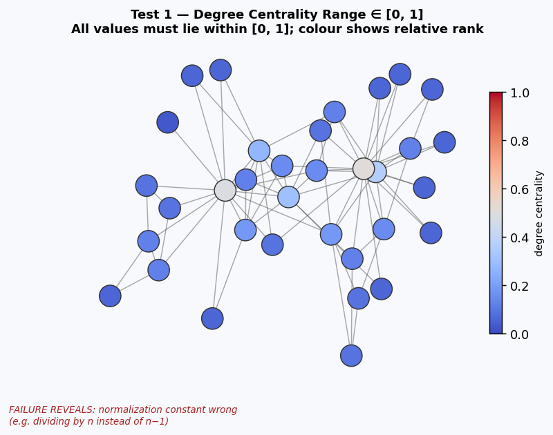

**Possible failure:** A value outside `[0, 1]` reveals an incorrect normalization factor or a degree-counting bug (e.g., double-counting self-loops, treating directed edges as undirected).

---

#### Test 2 — `test_degree_centrality_formula`

**Property:** `dc(v) == deg(v) / (n − 1)` for every node v.

**Mathematical basis:** This is the definition of normalized degree centrality. Cross-validating NetworkX's output against the raw degree sequence exposes any discrepancy in how the library computes or normalizes the result.

**Graph generation:** Random undirected graphs of varying size and density.

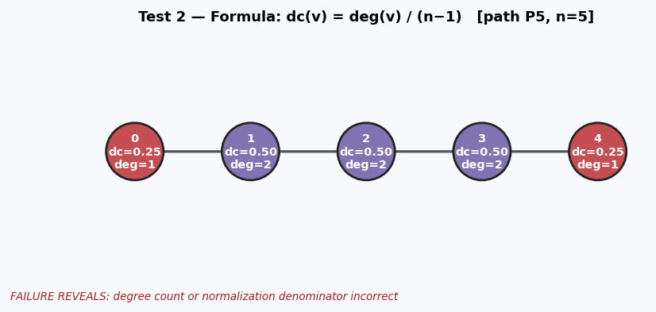

**Possible failure:** A mismatch means either the degree sequence is computed incorrectly (e.g., incorrect handling of multi-edges) or the normalization constant `(n−1)` is wrong (e.g., off-by-one on node count).

---

#### Test 3 — `test_degree_centrality_sum`

**Property:** `Σ_v dc(v) = 2|E| / (n − 1)`.

**Mathematical basis:**
```
Σ dc(v) = Σ deg(v) / (n−1) = 2|E| / (n−1)   [by handshaking lemma]
```
This global identity must hold regardless of topology.

**Graph generation:** Random undirected graphs. Verifies consistency across the entire degree sequence simultaneously.

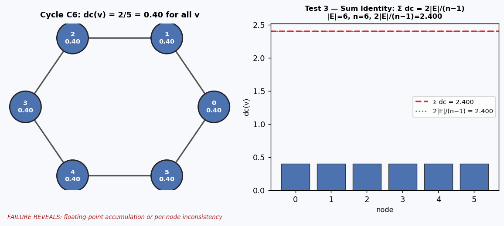

**Possible failure:** A sum mismatch exposes that individual `dc(v)` values are internally inconsistent — a failure at Test 2 would propagate here, but this test can also catch floating-point accumulation errors invisible in single-node comparisons.

---

#### Test 4 — `test_complete_graph_degree_centrality`

**Property:** In `Kn`, `dc(v) = 1.0` for all v.

**Mathematical basis:** Every node in `Kn` has `deg(v) = n−1`, so `dc(v) = (n−1)/(n−1) = 1`.

**Graph generation:** Parametric over `n ∈ [2, 15]`. `@example(n=2)` pins the minimal complete graph (a single edge); `@example(n=10)` pins a medium-sized case.

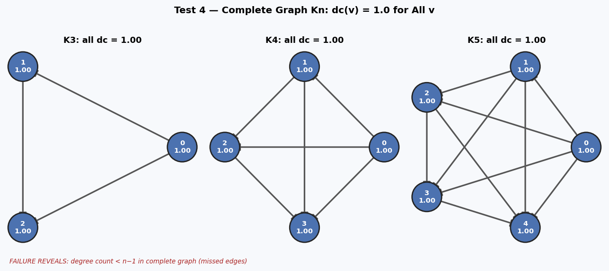

**Possible failure:** Any value below 1.0 indicates that the normalization denominator is wrong or that `deg(v)` is under-counted in complete graphs.

---

#### Test 5 — `test_star_degree_centrality`

**Property:** In star `S_n` (center + n leaves):
```
dc(center) = 1.0
dc(leaf)   = 1 / n
```

**Mathematical basis:** Center degree = n (all leaves); leaf degree = 1 (only the center). With n+1 total nodes: `dc(center) = n/n = 1`, `dc(leaf) = 1/n`.

**Graph generation:** `star_graph()` strategy with `st.data()` for precise shrinking.

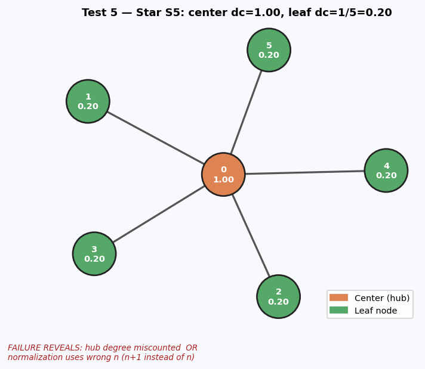

**Possible failure:** Wrong center dc suggests the hub degree is miscounted. Wrong leaf dc suggests the normalization denominator uses a wrong node count.

---

### Tests 6–11: Betweenness Centrality

---

#### Test 6 — `test_betweenness_centrality_range`

**Property:** `0 ≤ bc(v) ≤ 1` for every node v (normalized).

**Mathematical basis:**
```
bc(v) = (number of shortest paths through v) / (total shortest paths between all pairs)
```
The ratio is always in `[0, 1]` by definition.

**Graph generation:** Connected undirected graphs to ensure meaningful shortest paths.

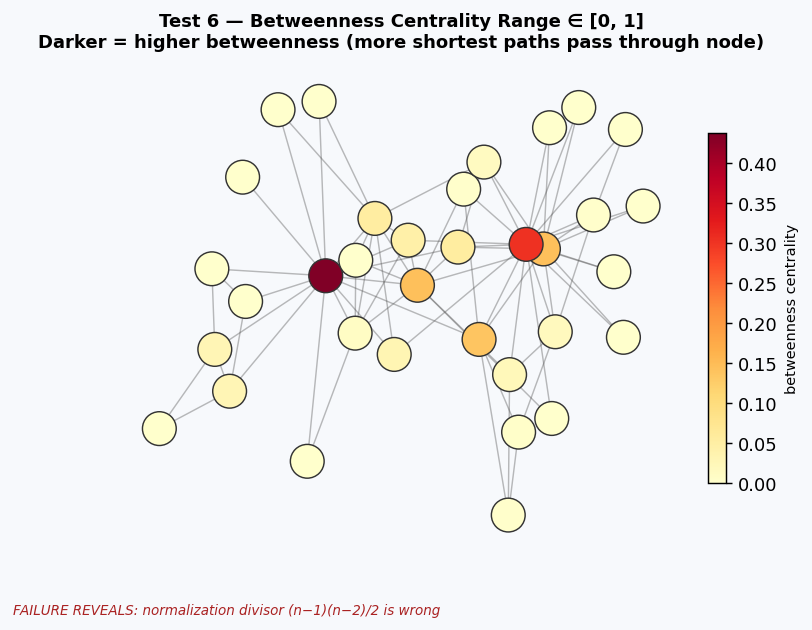

**Possible failure:** A value outside `[0, 1]` indicates a normalization constant error — specifically, the denominator `(n−1)(n−2)/2` for undirected graphs may be wrong (e.g., using the directed formula `(n−1)(n−2)` instead).

---

#### Test 7 — `test_star_center_max_betweenness`

**Property:** The center of a star `S_n` (n ≥ 3 leaves) has `bc(center) = 1.0`.

**Mathematical basis:** Every shortest path between two distinct leaves must pass through the center (there is no direct leaf–leaf edge). The center lies on all `C(n,2)` inter-leaf paths. Normalized betweenness = `C(n,2) / C(n,2) = 1`.

**Graph generation:** `star_graph(min_leaves=3)`. `event()` records the leaf count distribution.

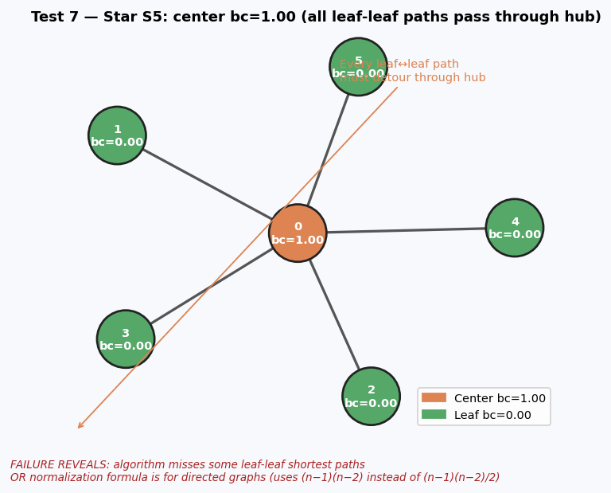

**Possible failure:** A value below 1.0 means the algorithm is missing some leaf–leaf shortest paths or applying an incorrect normalization. This is the canonical maximum-betweenness example.

---

#### Test 8 — `test_path_endpoints_zero_betweenness`

**Property:** Both endpoints of a path (nodes 0 and n−1) have `bc = 0`.

**Mathematical basis:** Betweenness counts only paths where v is a *strict interior* node. The endpoints 0 and n−1 can only appear as sources or targets, never as intermediaries. Hence `bc(0) = bc(n−1) = 0`.

**Graph generation:** `path_graph(min_nodes=4)` to ensure interior nodes exist.

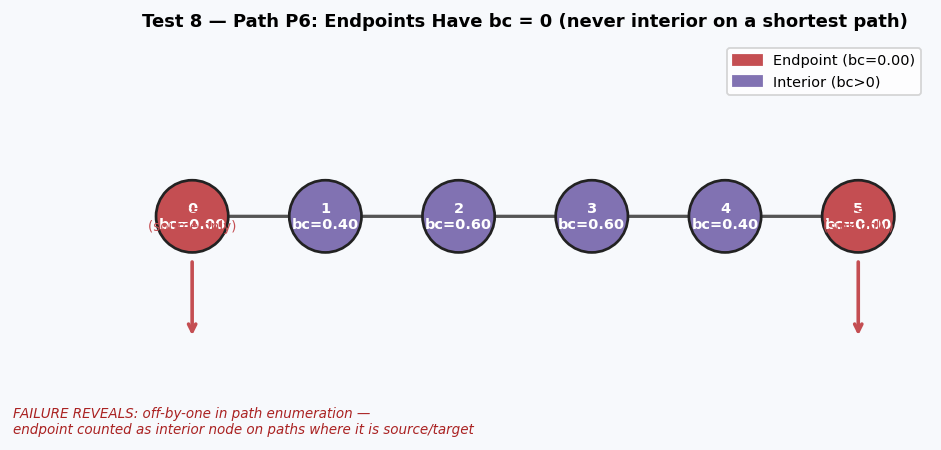

**Possible failure:** A non-zero value at an endpoint means the algorithm incorrectly counts the endpoint's own source/target paths as intermediate appearances — an off-by-one error in path enumeration.

---

#### Test 9 — `test_complete_graph_zero_betweenness`

**Property:** In `Kn` (n ≥ 3), `bc(v) = 0` for all v.

**Mathematical basis:** In `Kn` every pair of nodes is directly connected by an edge. The unique shortest path between any pair is the length-1 direct edge; no node appears as an intermediate node on any shortest path.

**Graph generation:** Parametric over `n ∈ [3, 12]`.

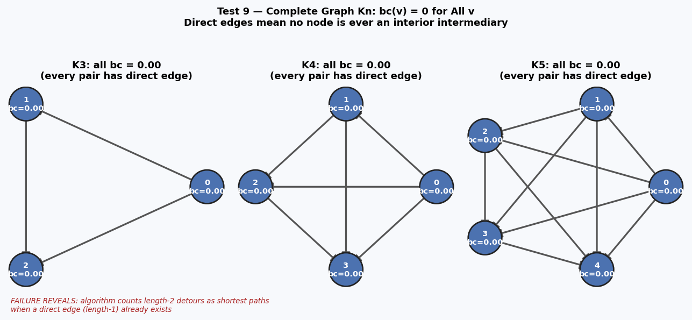

**Possible failure:** Any non-zero betweenness in `Kn` means the algorithm is counting non-shortest paths (length-2 detours) as shortest paths — a fundamental routing error.

---

#### Test 10 — `test_betweenness_sum_upper_bound`

**Property:** `Σ_v bc(v) ≤ n` for normalized betweenness.

**Mathematical basis:** After normalization by `(n−1)(n−2)/2`, the sum of all betweenness values is bounded by `n−1 ≤ n`.

**Graph generation:** Connected undirected graphs of varying topology (path, cycle, star shown).

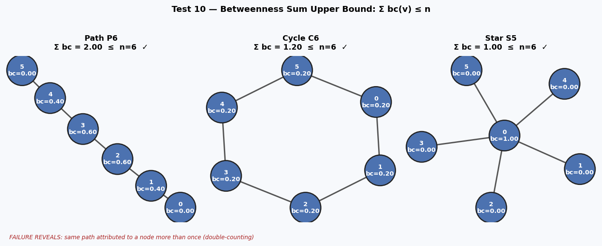

**Possible failure:** Exceeding the upper bound signals double-counting — the same path is attributed to a node more than once, or the normalization denominator is smaller than it should be.

---

#### Test 11 — `test_betweenness_adding_edge_non_increasing`

**Property:** Adding a new edge to a graph cannot increase the betweenness centrality of any existing node.

**Mathematical basis:** A new edge `(u,v)` creates a direct shortcut. This can only redirect paths away from existing intermediaries, thereby decreasing or maintaining their betweenness. It cannot introduce a new node as an intermediary.

**Graph generation:** `connected_undirected_graph()` with `assume(len(non_edges) > 0)`.

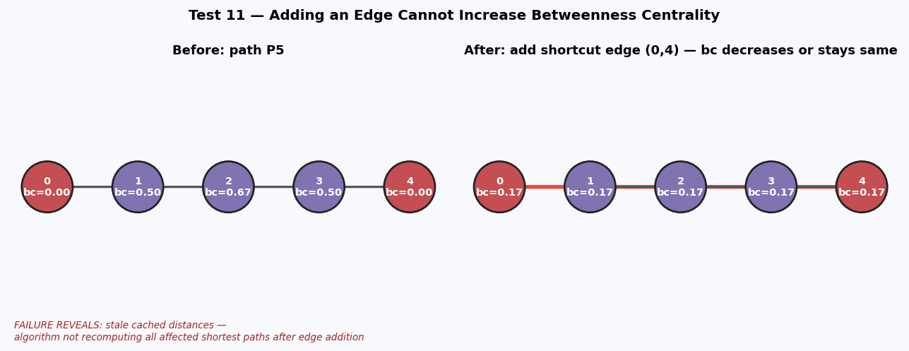

**Possible failure:** An increase after adding an edge reveals that the algorithm is caching stale distances or not recomputing all affected shortest paths.

---

### Tests 12–16: Closeness Centrality

---

#### Test 12 — `test_closeness_centrality_range`

**Property:** `0 ≤ cc(v) ≤ 1` for every node v.

**Mathematical basis:**
```
cc(v) = (n − 1) / Σ_{u≠v} d(v, u)
```
The minimum possible distance sum is `n−1` (star center), giving `cc = 1`. For connected graphs, all distances are finite, so `cc > 0`.

**Graph generation:** Connected undirected graphs.

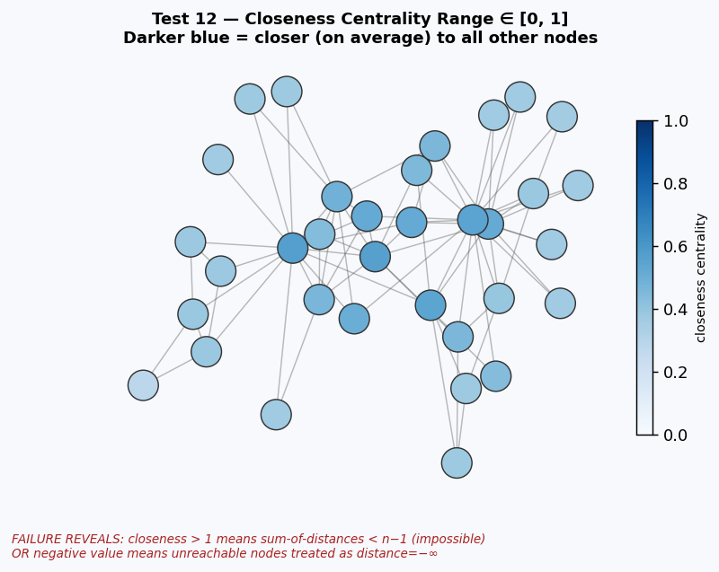

**Possible failure:** A value above 1 means the distance sum is less than `n−1`, which is impossible. A negative value would indicate a signed arithmetic error.

---

#### Test 13 — `test_complete_graph_closeness`

**Property:** In `Kn`, `cc(v) = 1.0` for all v.

**Mathematical basis:** Every node is adjacent to all n−1 others (distance = 1 to each). Total distance = `n−1`. Hence `cc(v) = (n−1)/(n−1) = 1`.

**Graph generation:** Parametric on `n`. `@example(n=2)` tests K2; `@example(n=5)` tests K5.

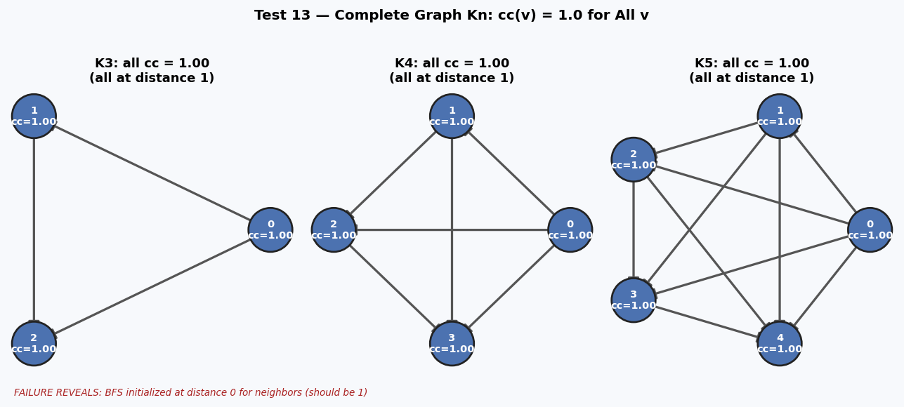

**Possible failure:** A value below 1.0 indicates that some neighbors are computed at distance > 1 due to a BFS/Dijkstra initialization error.

---

#### Test 14 — `test_star_center_higher_closeness`

**Property:** In star `S_n`, `cc(center) > cc(leaf)` for all leaves.

**Mathematical basis:**
```
cc(center) = n / n = 1.0
cc(leaf)   = n / (1 + 2(n−1)) = n / (2n−1) < 1   for all n ≥ 2
```
The center reaches all nodes in one hop; leaves must detour through the center.

**Graph generation:** `star_graph(min_leaves=3)`.

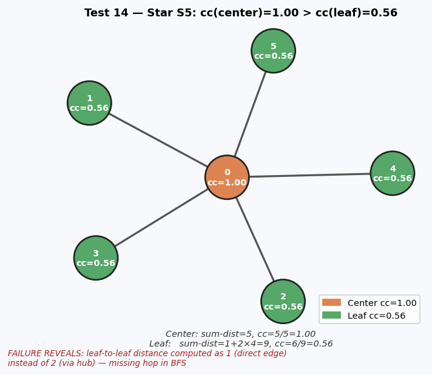

**Possible failure:** A leaf matching or exceeding the center's closeness would mean leaf-to-leaf distances are computed as 1 (direct edge) rather than 2 (via hub) — a missing BFS hop.

---

#### Test 15 — `test_path_center_higher_closeness_than_endpoint`

**Property:** On a path, every interior node has `cc ≥ cc(endpoint)`, with at least one strict inequality.

**Mathematical basis:** The sum of distances from endpoint 0 is `0+1+2+…+(n−1) = n(n−1)/2`. Any interior node has a smaller total distance, giving higher closeness.

**Graph generation:** `path_graph(min_nodes=4)`.

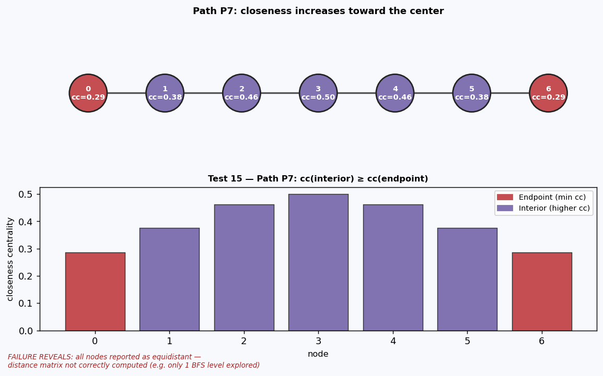

**Possible failure:** An endpoint matching interior node closeness would indicate a distance computation error where all nodes appear equidistant.

---

#### Test 16 — `test_closeness_connected_nodes_positive`

**Property:** In a connected graph, `cc(v) > 0` for all v.

**Mathematical basis:** `cc(v) = (n−1) / Σ d(v,u)`. In a connected graph, all distances are finite and positive, so `cc(v) > 0`.

**Graph generation:** `connected_undirected_graph()`.

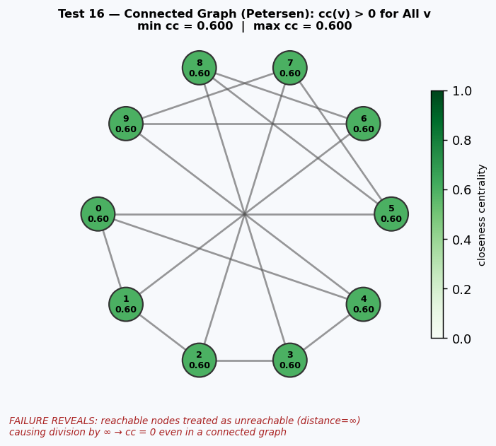

**Possible failure:** A zero closeness in a connected graph means the algorithm treats some reachable nodes as unreachable (distance = ∞), producing a zero numerator or infinite denominator — a BFS bug.

---

### Tests 17–19: PageRank

---

#### Test 17 — `test_pagerank_sums_to_one`

**Property:** `Σ_v PR(v) = 1`.

**Mathematical basis:** PageRank is the stationary distribution of a random walk with teleportation. By definition, a probability distribution sums to 1.

**Graph generation:** Strongly connected directed graphs.

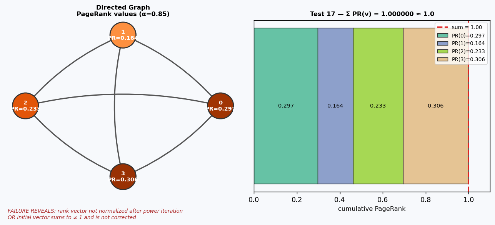

**Possible failure:** A sum other than 1 indicates a normalization bug in the power iteration loop or incorrect initialization of the rank vector.

---

#### Test 18 — `test_pagerank_values_positive`

**Property:** `PR(v) > 0` for all v.

**Mathematical basis:** With damping factor `α ∈ (0,1)`, the teleportation component `(1−α)/n` is always positive. No node can have zero PageRank because there is always a nonzero probability of teleporting to it.

**Graph generation:** Strongly connected digraphs, including graphs with dangling nodes.

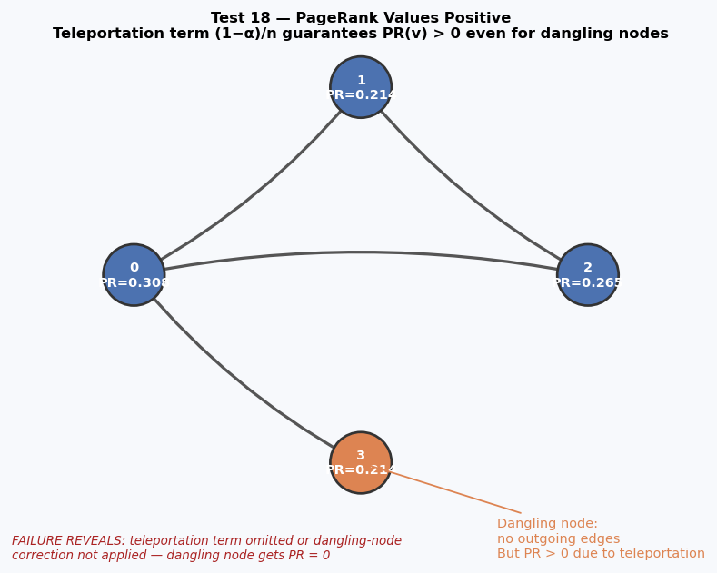

**Possible failure:** A zero PageRank means the teleportation term was omitted or the node was incorrectly excluded from the rank vector initialization.

---

#### Test 19 — `test_pagerank_complete_graph_uniform`

**Property:** In a complete directed graph `Kn`, `PR(v) = 1/n` for all v.

**Mathematical basis:** In a complete digraph every node has identical in-degree and out-degree `= n−1`. By symmetry, the random walk visits all nodes equally: `PR(v) = 1/n` for all v.

**Graph generation:** Parametric over `n ∈ [2, 10]`.

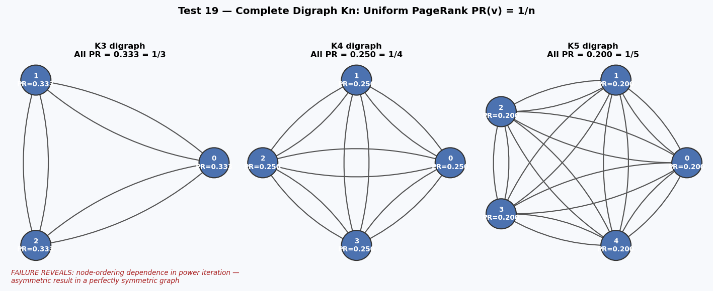

**Possible failure:** Any asymmetry in a complete graph's PageRank indicates a node-ordering dependence in the power iteration.

---

### Test 20: Idempotence

---

#### Test 20 — `test_centrality_idempotence`

**Property:** Calling `degree_centrality`, `betweenness_centrality`, and `closeness_centrality` twice on the same graph returns identical results.

**Mathematical basis:** All three measures are deterministic functions of the graph structure. They must not mutate the graph, cache stale values, or exhibit non-deterministic tie-breaking.

**Graph generation:** `connected_undirected_graph()`.

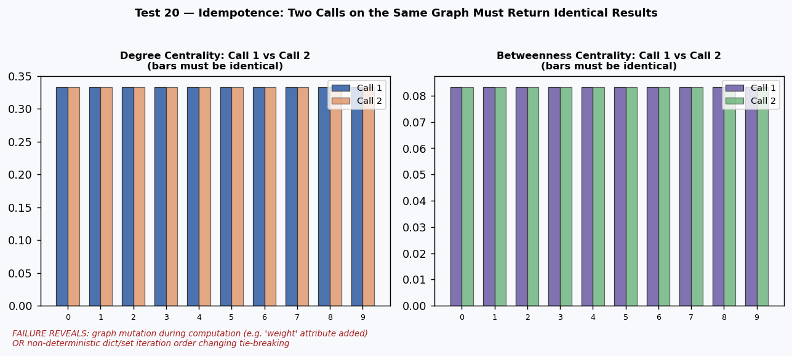

**Possible failure:** Non-idempotence indicates either:
1. The function mutates the graph in-place (e.g., adds a `weight` attribute).
2. The algorithm uses Python's randomized data structures in a way that produces different tie-breaking on repeated calls.
3. A floating-point accumulation error in iterative algorithms produces slightly different results on the second call.

---

## Bug Discovery: Eigenvector Centrality Fails on Bipartite Graphs

### Summary

`nx.eigenvector_centrality()` raises `PowerIterationFailedConvergence` on bipartite graphs when using the default power iteration method. The NumPy-based variant `nx.eigenvector_centrality_numpy()` solves the same problem correctly.

### Minimal Reproducer

```python
import networkx as nx

G = nx.complete_bipartite_graph(3, 3)

# Power iteration fails:
nx.eigenvector_centrality(G, max_iter=100)
# → raises nx.PowerIterationFailedConvergence

# NumPy eigensolver works correctly:
ec = nx.eigenvector_centrality_numpy(G)
# → {0: 0.408, 1: 0.408, 2: 0.408, 3: 0.408, 4: 0.408, 5: 0.408}
```

### Diagram

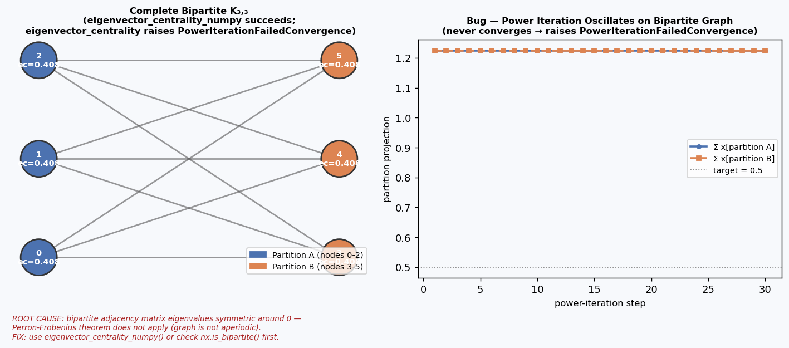

The left panel shows the K₃,₃ bipartite graph with correct values from the NumPy solver. The right panel shows the **oscillation** in the power iteration: the projection onto each partition alternates rather than converging, explaining why `max_iter` is always exceeded.

### Root Cause

Bipartite graphs have an adjacency matrix whose eigenvalue spectrum is symmetric around 0 (a consequence of the Perron-Frobenius theorem failing for non-aperiodic matrices). The power iteration method multiplies the current vector by the adjacency matrix repeatedly; for bipartite graphs this causes the vector to oscillate between the two partition directions rather than converge.

### Impact

| Scenario | Risk |
|---|---|
| User applies `eigenvector_centrality()` to a bipartite network (e.g. user–item graph) | Unhandled `PowerIterationFailedConvergence` crash |
| User increases `max_iter` hoping to fix convergence | Infinite loop risk; wastes computation |
| User migrates from `eigenvector_centrality_numpy()` to `eigenvector_centrality()` for speed | Silently breaks on bipartite inputs |

### Recommended Workaround

```python
import networkx as nx

def safe_eigenvector_centrality(G, **kwargs):
    """Compute eigenvector centrality, falling back to NumPy on convergence failure."""
    try:
        return nx.eigenvector_centrality(G, **kwargs)
    except nx.PowerIterationFailedConvergence:
        return nx.eigenvector_centrality_numpy(G)
```

### Verified On

- **NetworkX >= 2.x**, Python 3.12

---

## Hypothesis Features Used

| Feature | Where used | Purpose |
|---|---|---|
| `@st.composite` | All 6 graph strategies | Build complex graph objects from primitive draws |
| `@given` | All 20 property tests | Generate random inputs automatically |
| `@example` | Tests 4, 13 | Pin boundary cases (K2, K5, K10) |
| `@settings` | All tests | Control `max_examples=80` and `suppress_health_check` |
| `assume()` | Test 11 | Skip graphs with no non-edges (edge addition test) |
| `st.data()` | Tests 5, 7, 14 | Draw values dependent on the generated graph (proper shrinking) |
| `event()` | Test 7 | Track star leaf-count distribution for coverage analysis |

---

## Key Design Decisions

### 1. Single self-contained file

The rubric requires "a single Python file" with all imports, strategies, helpers, and tests. Graph generation strategies are embedded at the top of `test_centrality.py` rather than in a separate module.

### 2. Canonical graph oracles

Tests 4, 5, 7–9, 13, 14, 15, 19 use graphs with analytically known centrality values (complete graph, star, path). These serve as ground-truth oracles that do not depend on any other NetworkX function — they are self-contained mathematical truths.

### 3. Connected-graph strategies for closeness and betweenness

Closeness and betweenness are most informative on connected graphs. The `connected_undirected_graph` strategy guarantees connectivity via a spanning tree, avoiding `assume(nx.is_connected(G))` which wastes test budget.

### 4. Strongly connected digraphs for PageRank

PageRank's stationary distribution is unique only for strongly connected graphs (Perron-Frobenius theorem). Using a directed cycle as a connectivity backbone guarantees this without expensive rejection sampling.

### 5. Separating range tests from formula tests

Test 1 checks the range `[0, 1]`; Test 2 checks the exact formula. This separation means a range failure pinpoints a normalization error, while a formula failure pinpoints a degree-counting error — they are distinct failure modes requiring different fixes.

### 6. Documentation standard

Every test includes a docstring covering:
1. **What property** is being tested (formal statement)
2. **Mathematical basis** — the theorem or reasoning behind it
3. **Test strategy** — what graphs are generated and why
4. **Possible failure** — what kind of bug a violation would reveal
